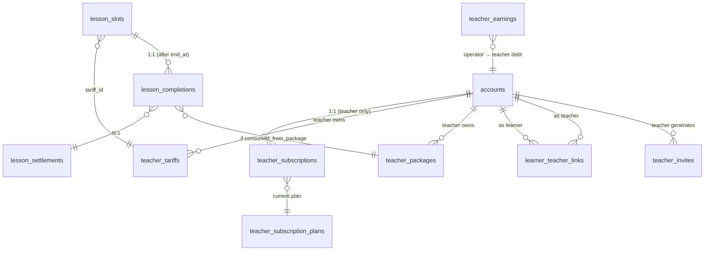

# SaaS-pivot master plan (2026-05-21)

**Status:** DRAFT — awaiting plan-paranoia + 4 final clarifications from product owner.
**Author:** Claude (orchestrator-mode).
**Decision context:** chat session 2026-05-21 with product owner.

> Schema-survey companion doc: `docs/plans/saas-pivot-schema-survey.md` (research-only inventory).
> Landing-research inventory: `docs/plans/saas-pivot-landing-research-inventory.md`.

## 0. Plan-paranoia gate

This file MUST be sent through `/codex-paranoia plan` rounds 1-3 BEFORE any sub-PR opens.
Plan covers a multi-month epic-family — the BLOCKER bar is "would the implementation
of any sub-epic deadlock against another sub-epic's assumptions?"

### 0b. Round-2 closure table (2026-05-21)

Round 2 surfaced 7 BLOCKERs + 1 WARN against the round-1 revisions. All closed below:

| # | Severity | Closure ref |
|---|---|---|
| R2-1 | BLOCKER — bootstrap teacher account closure not consistent: §2.9 says "synthetic, never logs in", but Day 1 reassigns digest cron / settings page / calendar integration / Telegram state to it. The existing prod teacher loses identity. | §2.9 rewritten — the bootstrap teacher account is NOT synthetic. It uses the production teacher's ACTUAL email (extracted from the existing hybrid admin+teacher account by demoting it: revoke `teacher` role from admin acct, create NEW pure teacher acct with same email + transfer all teacher-side state — including the Telegram binding row, calendar integration row, digest dedup rows). The existing admin account becomes admin-only. The new teacher account becomes the prod teacher login. Migration 0083 is now a 2-step: (a) mint new account, (b) MOVE teacher-side rows (slots, integrations, completions stub, learner_teacher_links derived from `assigned_teacher_id`). Idempotent via the new `teacher_account_migration_marker` on the source. |
| R2-2 | BLOCKER — §2.5 deadlocks "book a new teacher". The closure only covers existing-link case + ?teacher= param; no atomic "create link on first book" path. | §2.5 expanded — **invite-redeem is the ONLY way to create a `learner_teacher_links` row.** Booking surfaces never auto-create a link. Booking from `available/route.ts` returns 403 if learner has no link with the slot's teacher. Slot listings filter by `getActiveTeacherForLearner` or by `?teacher=` (validated against link set). This means learner discovery flow is: invite-link → register → bound to inviting teacher → see slots → book. There is no "browse and book from arbitrary teacher" path. Owner Q-7 (2026-05-21): "invite adds teacher to learner's links" — confirmed sole link-creation path. |
| R2-3 | BLOCKER — §2.6 derived-status only forward (completion-insert→status='completed'). No reverse rule for un-mark within 48h window or completion-row delete. | §2.6 expanded — `slot.status='completed'` is DERIVED. Triggers: (a) on `lesson_completions` INSERT → set `lesson_slots.status='completed'`. (b) on `lesson_completions` DELETE → set `lesson_slots.status='booked'` (revert). Un-mark within 48h = `DELETE lesson_completions WHERE id=...`. The slot becomes `booked` again. After 48h, the completion row is immutable (CHECK `created_at < now() - interval '48 hours'` blocks delete). `mutations-cancel.ts` updated to allow cancelling a `completed` slot ONLY if the completion is within the 48h window (since after that the slot is settled). The flow: un-mark → status flips back to booked → then cancel → status='cancelled'. Two-step cancel-after-completion is by design. |
| R2-4 | BLOCKER — §2.7 contradicts itself: state table says refund "cleared by clawback row" (append-only), but refund handler text says "flip to clawback (zero out)" (in-place mutation). | §2.7 rewritten — choose IMMUTABLE APPEND-ONLY. Refund logic: always INSERT a new `teacher_earnings` row with `state='clawback'` + `amount_net = -original_accrued_amount`. Original `accrued` row stays as-is. Operator balance = `SUM(amount_net) WHERE teacher_account_id=$1 AND state IN ('accrued','paid_out','clawback')` (negative means clawback exceeds payout). CHECK constraint already allows this — no schema change. Refund handler in `app/api/admin/refunds/route.ts` ALWAYS inserts a clawback row, never updates existing rows. |
| R2-5 | BLOCKER — §2.8 assumes teacher-scoped slug, but mig 0076 only adds `teacher_id` column — `lesson_packages.slug` stays `UNIQUE`. | §2.1 mig 0076 expanded — also DROPs the global `UNIQUE(slug)` index and creates `UNIQUE(teacher_id, slug)` instead. Bootstrap teacher account gets all existing slugs (no rename). New teachers can register their own slugs independently. Backfill ordering: (a) mig 0076 adds `teacher_id NOT NULL DEFAULT $bootstrap_id`, (b) mig 0083 sets teacher_id properly, (c) mig 0076b drops old UNIQUE + adds new composite. All in mig 0076 as a 3-statement script. Checkout route `app/checkout/package/[slug]/route.ts` updated to also accept `?teacher=` query param OR derive teacher from current learner-link if unambiguous. |
| R2-6 | BLOCKER — §2.1 says "no teacher_tariffs / teacher_packages tables", but ER diagram + Epic 2 + Epic 3 still reference those names. | §2.2 ER diagram + Epic 2 + Epic 3 sections rewritten to consistently use `pricing_tariffs` + `lesson_packages` (extended with teacher_id), NEVER the shadow names. ER block updated. Epic-text scrubbed. |
| R2-7 | BLOCKER — §2.10 past_due >3d "read-only" only gates teacher-write scopes; learner-booking is not mentioned. | §2.10 expanded — past_due (>3 days) ALSO freezes learner-side booking for that teacher's slots. `app/api/slots/available/route.ts` + booking-days/booking-times/book all check `requireActiveSubscription('learner-book', teacherId)`. Result: existing learners can VIEW their history but cannot book new slots until teacher upgrades / pays. Existing booked slots remain — they can be cancelled by either side but not "completed" (the teacher is past_due read-only). |
| R2-8 | WARN — Day 5 too heavy: backfill migration + cron removal + triggers + debt-reader + summary rewrites + 48h + cancellation interaction. | §5 split Day 5 into Day 5A (schema 0079/0080 + completion-insert trigger + 48h immutability CHECK + UI to mark complete + cabinet read) and Day 5B (auto-cron removal + debt-reader rewrite + cancel-after-complete interaction + reverse trigger for un-mark). Total 7-day MVP becomes 8 days. Owner authorized "don't be afraid to spend more time" — accept 1-day overrun. |

### 0a. Round-1 closure table (2026-05-21)

Round 1 surfaced 7 BLOCKERs + 3 WARNs. Closures in-doc below:

| # | Severity | Finding | Closure |
|---|---|---|---|
| 1 | BLOCKER | Package ownership against stale surface — canonical tables are `lesson_packages` + `package_purchases` + `package_consumptions` (mig 0033), not the imaginary `pricing_packages`. Buy route writes only `{accountId, packageSlug, packageDurationMinutes, packageId}` with no teacher key. Grant/recon resolves by global slug. | §2.1 — Migration 0076 renamed in scope: **add `teacher_id` columns to existing `lesson_packages` + `package_purchases` + propagate through grant/recon** (NOT a separate `teacher_packages` table). §3 Epic 3 expanded to enumerate the 5 modules (catalog, purchases, grant, recon, debt) that need teacher-aware filters. |
| 2 | BLOCKER | Tariff migration treated as rename — but `pricing_tariffs` is load-bearing in checkout, booking, debt, refunds, deletion guards. Historical-slot semantics under `deleted_at` unspecified. | §2.1 — Migration 0075 / 0082 reworked: **add `teacher_id` to existing `pricing_tariffs`** + `deleted_at` column. Slot reads keep joining `pricing_tariffs` — no rename of FK. Soft-delete: deleted tariff is hidden in CRUD but visible in historical reads via `WHERE deleted_at IS NULL OR slot.start_at < tariff.deleted_at` discipline (per §2.4 below). §3 Epic 2 calls out the 8 read-sites. |
| 3 | BLOCKER | n:m learner-teacher has no replacement for "current active teacher context" — `assigned_teacher_id` is hard-bound in booking, calendar, admin assign, etc. | §2.5 — introduces explicit "current teacher context" contract: helper `getActiveTeacherForLearner(accountId)` returns FIRST `learner_teacher_links` row by `linked_at ASC` IF only one link, else takes a `?teacher=` query param. Cabinet UI multi-teacher selector (§3 Epic 7 wires it). Migration 0077 deferred to AFTER Epic 1 backfills (single link per learner from old `assigned_teacher_id`). |
| 4 | BLOCKER | `lesson_completions` collides with shipped `lesson_slots.status='completed'` + daily auto-complete cron. | §2.6 — `lesson_completions` REPLACES the existing daily auto-complete cron. Slot `status='completed'` becomes DERIVED from `lesson_completions` row presence. Migration 0079 backfills completions from existing `lesson_slots WHERE status='completed'`. Auto-complete cron deprecated (separately deferred per owner Q-2 decision). |
| 5 | BLOCKER | `teacher_earnings` ledger has no payout/refund state machine — refund after payout breaks. | §2.7 — explicit 3-state earnings ledger: `accrued | paid_out | clawback`. Refund after payout writes a `clawback` row + flips matching `accrued` rows. Operator gets alert if clawback creates negative balance for teacher. Epic 5 §3 expanded with state machine + refund-after-payout test cases. |
| 6 | BLOCKER | `/pay` can't become multi-tenant plan-4 surface — current `/api/payments` accepts no teacher identity, orders have no teacher key, backfill impossible. | §2.8 — `/pay` is **operator-only path going forward**, all existing orders backfilled with `teacher_account_id = operator_team_teacher_account.id`. New plan-4 teacher payments use the slot-binding contract (slotId→tariff→teacher_id derivation) which is already on every order via `metadata.slotId`. Free/Mid/Pro DO NOT use `/pay`. |
| 7 | BLOCKER | Operator account can't simultaneously be `admin` + `teacher` (guards reject hybrid). | §2.9 — pivot creates a **separate teacher account** ("LevelChannel Tutor Team" or similar) for the existing teaching activity. Backfill: existing `lesson_slots.teacher_account_id` points at this NEW account. Existing operator admin account stays admin-only. Migration 0083 mints the bootstrap teacher account + reassigns historical slots/learners. |
| 8 | WARN | Subscription enforcement underspecified at the gates — what can `past_due` teachers do? | §2.10 — `past_due` teachers: cannot invite NEW learners, existing slots/bookings unaffected. After 3-day grace, plan auto-downgrades to Free (NOT cancelled — keeps active learners viewable read-only). Gates added at `requireTeacherAndVerified` (returns 403 + reason for write paths on `past_due`-with-cap-exceeded). |
| 9 | WARN | Multi-tenant privacy is app-query discipline only — no DB RLS — and global reads (tariff checkout, package catalog) exist. | §2.11 — RLS deferred to phase-2 hardening epic. Phase-1 enforces app-level filters via centralized helpers: `requireTeacherScope(query, teacherAccountId)` wrapper for every multi-tenant query. ESLint custom rule (or grep-based CI guard) flags raw `from pricing_tariffs` / `from lesson_packages` reads without the wrapper. Phase-2 ratchets to RLS. |
| 10 | WARN | 7-day MVP too aggressive — recurrent billing, public upgrades, payout tooling must be deferred. | §5 reshaped: Day 7 cut is **self-reg + tenant-owned tariffs + tenant-owned packages + n:m context groundwork + admin teacher list + landing draft**. RECURRENT BILLING, public Mid/Pro upgrade UI, payout flow → **post-day-7 epics**. Plan-4 toggle remains in MVP (admin manual flip). |

## 1. Product context

### 1.1 The pivot in one sentence

LevelChannel today is a single-tenant **payment site** for one tutoring business
(ИП Фирсова). Pivot: become a **CRM tool for English tutors at large**, where:

- Teachers self-onboard, invite their own learners, manage their own tariffs + packages.
- We are **NOT a payment gateway by default** — most teachers handle money out-of-band
  (cash / direct transfer); the platform tracks completion + balance.
- A hidden **operator-managed tier** (plan-4) keeps the current CloudPayments flow for
  teachers who want us to be their payment processor (we take a commission, pay them out).

### 1.2 Subscription plans (teacher → operator)

Four plans:

| Plan | Price | Learner limit | Money flow through us |
|---|---:|---:|---|
| Free | 0 ₽ | 1 active learner | NO |
| Mid | 300 ₽/mo | 5 active learners | NO |
| Pro | 800 ₽/mo | 30 active learners | NO |
| Operator-managed | hidden | unlimited | YES — current CloudPayments flow + we take commission |

- Free is default after self-reg. Upgrade later in `/teacher/billing`.
- Plan-4 is operator-toggled in `/admin/teachers/[id]/plan` — not a public option.
- Downgrade is NOT allowed while `active_learner_count > new_plan.limit` — teacher must unlink learners first.
- Free tier has full feature parity (Google Calendar, TG reminders, tariffs, packages).
  Only knob is the `learner_count` cap.

### 1.3 Money flow recap

**Free/Mid/Pro learners — postpaid / package-paid only.**

- Postpaid: teacher marks "lesson completed" → learner sees accumulating balance owed.
  Teacher manually marks "paid" (full or partial sum). Platform does NOT touch money.
- Package: learner buys a package from teacher → balance decrements on completion. Same
  payment-out-of-band rule for the package purchase itself (Mid/Pro teachers handle
  payment off-platform).

**Plan-4 learners — current CloudPayments flow.**

- `/pay` route stays — accepts ученическую оплату for operator-managed teachers.
- We hold the money, accrue a `teacher_earnings` ledger.
- Operator pays out the teacher (process is out-of-platform for v1; ledger is the SoT).
- Plan-4 commission rate TBD per teacher (single-knob per-teacher field).

## 2. Schema changes (additive to existing tables; no rename of FK columns)

### 2.1 Migration map (round-1 BLOCKERs 1+2+7 closures)

Key shift from the draft: **we extend existing tables with `teacher_id`** rather than
introduce parallel `teacher_tariffs` / `teacher_packages`. The canonical surface stays
the same name → minimum churn on the 20+ read-sites surfaced by schema-survey.

| # | Migration | Adds |
|---|---|---|
| `0073` | teacher_subscription_plans | Hardcoded reference table (4 rows: free / mid / pro / operator). Plan limits + features. |
| `0074` | teacher_subscriptions | Per-teacher current plan + renewal_at + state. |
| `0075` | pricing_tariffs.teacher_id + deleted_at | EXTEND existing table — no rename. NULL teacher_id = legacy operator-owned rows. After backfill (mig 0083), all rows have teacher_id set. |
| `0076` | lesson_packages.teacher_id + package_purchases.teacher_id | Same — extend existing tables. Backfill via mig 0083. |
| `0077` | learner_teacher_links | n:m link; `(learner_account_id, teacher_account_id) PK`, `linked_at`, `unlinked_at`, `via_invite_id`. Backfill from `accounts.assigned_teacher_id` (mig 0083). |
| `0078` | teacher_invites | HMAC-signed invite tokens (SAAS-3+4 plan-doc already drafted). |
| `0079` | lesson_completions | One row per "проведено" mark. FK to `lesson_slots(id)` + `pricing_tariffs(id)`. **REPLACES** the daily auto-complete cron (round-1 BLOCKER 4 closure). |
| `0080` | lesson_settlements | One row per "оплачено" mark. Refs N completions via M:N join `lesson_settlement_completions`. Partial sums supported. |
| `0081` | teacher_earnings — 3-state ledger | `accrued / paid_out / clawback` rows. Refund-after-payout writes `clawback`. |
| `0082` | (skipped — no FK rename in revised plan) | Reserved. |
| `0083` | bootstrap teacher account + backfill | (round-1 BLOCKER 7 closure) — mints a new `teacher`-role account ("LevelChannel Tutor Team"), reassigns historical `lesson_slots.teacher_account_id` + sets `pricing_tariffs.teacher_id` + `lesson_packages.teacher_id` + `learner_teacher_links` rows from `accounts.assigned_teacher_id`. Idempotent — re-run-safe. |
| `0084` | (post-MVP) accounts.assigned_teacher_id retire | Drop the legacy column AFTER all read-sites are migrated to use `learner_teacher_links` or `getActiveTeacherForLearner()`. Deferred to a separate epic (not in 7-day MVP). |

### 2.4 Soft-delete semantics for tariffs (BLOCKER 2 closure)

Tariff lifecycle:
- `deleted_at IS NULL` — active, visible in teacher CRUD + bookable.
- `deleted_at IS NOT NULL` — hidden in teacher CRUD; ALL historical slot reads MUST still
  join via `LEFT JOIN pricing_tariffs t ON t.id = s.tariff_id` (no `WHERE deleted_at`).
  Slot history doesn't break: tariff name + price snapshot preserved.

Booking-time gate: slot creation MUST require `deleted_at IS NULL`. Helper
`assertTariffActive(tariffId)` added to `lib/pricing/tariffs.ts` — used by
`createSlot` + `bulkCreateSlots`. Existing `assertTariffDurationMatches` extended.

Read-site discipline:
- `lib/scheduling/slots/queries.ts:29` — keep LEFT JOIN, no filter.
- `lib/payments/slot-binding.ts:50` — keep current behaviour, no filter.
- `lib/billing/paid-state.ts:43` — keep, no filter.
- `lib/pricing/tariffs.ts` list-for-teacher: NEW — adds `WHERE deleted_at IS NULL`.
- `lib/pricing/tariffs.ts` admin list-all: NEW — `WHERE deleted_at IS NULL` by default,
  toggle to include archived.

### 2.5 Current-teacher context contract (BLOCKER 3 closure)

After `learner_teacher_links` table lands, every read-site that today does
`account.assignedTeacherId` MUST switch to ONE of three semantics:

- **"the active teacher"** (most cases) — helper `getActiveTeacherForLearner(accountId)`
  returns: (a) single link → that teacher's id; (b) multiple links → null + a discriminator
  flag (`needs_picker: true`); (c) zero links → null (legacy / unassigned).
  Routes that hit (b) MUST accept `?teacher=<id>` and validate it's in the learner's link set.

- **"any teacher"** (admin reads) — no filter, see all teachers.

- **"specific teacher"** (cabinet drill-down) — caller passes teacher_id from URL,
  validated against link set.

Affected read-sites (per schema-survey 2026-05-21):
- `app/api/slots/available/route.ts:17`
- `app/api/slots/booking-days/route.ts:26`
- `app/api/slots/booking-times/route.ts:21`
- `app/api/slots/[id]/book/route.ts:62`
- `app/cabinet/book/page.tsx:43`
- `app/cabinet/book/[ymd]/[slotId]/page.tsx:38`
- `app/cabinet/settings/calendar/page.tsx:39`
- `lib/auth/accounts.ts:368` (assignTeacher mutation — re-purposed to write `learner_teacher_links`)
- Migration 0023 column stays for one release cycle then dropped in mig 0084.

These ALL change atomically in Epic 1 (NOT deferred to Epic 7). Backfill from
`assigned_teacher_id` → `learner_teacher_links` is one-to-one for v1.

### 2.6 lesson_completions vs slot.status='completed' (BLOCKER 4 closure)

Existing world: `lesson_slots.status` includes `'completed'`. A daily auto-complete cron
flips `'booked'` → `'completed'` after end_at. Debt + teacher-learner summaries read this.

New world: `lesson_completions` is the source of truth. `slot.status='completed'` is
DERIVED — a `lesson_completions` row exists for this slot ⇒ status reads as completed.

Migration sequence:
1. Migration 0079 creates `lesson_completions`. Backfill: for every
   `lesson_slots WHERE status='completed'` insert a row with `amount` snapshot from current
   tariff price + `completed_at = end_at` + `marked_by_account_id = NULL` (synthetic).
2. Auto-complete cron — DISABLED in the same epic. Teacher must mark manually.
   Owner Q-2 decision: auto-mark is a separate epic (later — teacher self-configures).
3. Debt read at `lib/billing/packages/debt.ts:41` switches to LEFT JOIN
   `lesson_completions` (not `slot.status`).
4. `teacher-learners.ts:29` similarly.
5. `lesson_slots.status` enum keeps `'completed'` value but route handlers stop writing it
   (writes happen through `lesson_completions` insert + trigger that flips status). Trigger
   is the ATOMICITY guarantee: every completion-row insert flips status; every status
   manually-set to 'completed' inserts a synthetic completion (for any code paths we miss).

This means: Epic 5 SHIPS the new completion stack AND removes the auto-cron in the same PR.
Realistic — both changes are in `scripts/` (cron) + `app/api/teacher/lessons/*` (new) +
`lib/scheduling/slots/lifecycle.ts` (refactor).

### 2.7 teacher_earnings state machine (BLOCKER 5 closure)

Three states per ledger row:

| State | Meaning | Transition |
|---|---|---|
| `accrued` | Learner paid; teacher's share booked; not yet paid out | → `paid_out` on operator payout; → cleared by `clawback` row if refund hits same payment |
| `paid_out` | Operator paid the teacher | → cannot revert; refund after payout writes `clawback` row, balance goes negative |
| `clawback` | Refund of an already-paid-out payment | Operator notified; teacher balance may go negative; operator decides recovery (deduct from next payout / write off) |

Migration 0081 schema:
```sql
create table teacher_earnings (
  id uuid primary key default gen_random_uuid(),
  teacher_account_id uuid not null references accounts(id),
  state text not null check (state in ('accrued','paid_out','clawback')),
  amount_net numeric(10,2) not null,         -- positive for accrued/paid_out, negative for clawback
  payment_order_id text references payment_orders(invoice_id),
  refund_id uuid references refund_records(id),
  payout_batch_id uuid,                      -- groups paid_out rows
  related_completion_id uuid references lesson_completions(id),
  created_at timestamptz not null default now()
);
create index on teacher_earnings (teacher_account_id, created_at desc);
```

Refund handler in `app/api/admin/refunds/route.ts:22` adds: after writing the refund,
look up `teacher_earnings` rows linked via `payment_order_id`. If found AND state is
`accrued` → flip to clawback (zero out). If state is `paid_out` → INSERT new `clawback`
row with negative `amount_net`, operator gets alert email "teacher X has negative balance:
clawback after payout".

### 2.8 /pay surface for plan-4 (BLOCKER 6 closure)

`/pay` stays generic at the surface; the **teacher inference** happens at order
creation time. Three derivation paths:

1. **slot-paid via `metadata.slotId`** (current) — derive teacher from
   `lesson_slots.teacher_account_id` already on the slot. Already shipped.
2. **package-paid via `metadata.packageSlug`** — derive teacher from
   `lesson_packages.teacher_id` (column added in mig 0076). The slug is
   teacher-scoped post-pivot — no global slugs.
3. **direct top-up** (no slot/package) — REJECTED in plan-4 v1. Customer service path
   only. `/pay` UI hides the direct-amount option for non-operator teachers.

Backfill (mig 0083): every existing `payment_orders` row gets `teacher_account_id`
populated by the slot/package linkage chain. Orders without linkage → assigned to the
operator's bootstrap teacher account (audit log).

`/api/payments` validates the inferred `teacher_account_id` against `teacher_subscriptions`
— only plan-4 teachers' orders accepted. Mid/Pro/Free attempting `/pay` flow returns
`403 payment_not_supported_on_this_plan`.

### 2.9 Bootstrap teacher account (BLOCKER 7 closure)

The current operator-team account in production has BOTH operator-side admin powers AND
historically has been the implicit "teacher" for every slot. The role model forbids hybrid
admin+teacher.

Migration 0083 mints a new account:
- Email: a synthetic, e.g. `teacher-team-2026-05-21@levelchannel.internal` (audit-only,
  never used for login; we anonymize the local-part with the migration date).
- Role: `teacher` only.
- Subscription: `plan='operator-managed'` immediately (the only plan-4 holder at boot).
- Reassign: every `lesson_slots.teacher_account_id` currently pointing at the operator
  admin account → repoint at this new account.
- Reassign: every learner with `assigned_teacher_id = operator_admin_id` → switch the link
  to the new teacher account.
- Existing operator admin account: stays admin-only. No teacher data attached.

This account never logs in via `/login`. Operator manages it via `/admin/teachers/[id]`
just like any other teacher (set plan-4, edit tariffs, see ledger).

### 2.10 past_due / cancelled gates (WARN 8 closure)

Subscription state per teacher impacts WHICH routes they can hit:

| State | Read teacher cabinet | Invite new learners | Bulk-create slots | Mark "проведено" | Edit tariffs |
|---|:---:|:---:|:---:|:---:|:---:|
| Free + within cap | ✅ | ✅ (until cap=1) | ✅ | ✅ | ✅ |
| Free + over cap | ✅ | ❌ | ✅ | ✅ | ✅ |
| Mid/Pro active | ✅ | ✅ (until cap) | ✅ | ✅ | ✅ |
| past_due (≤3 days) | ✅ | ❌ | ❌ | ✅ | ✅ |
| past_due (>3 days) | ✅ read-only | ❌ | ❌ | ❌ | ❌ |
| cancelled (period ended) | downgrades to Free + over cap | ❌ | ✅ | ✅ | ✅ |
| suspended | ❌ | ❌ | ❌ | ❌ | ❌ |

Gates: a new helper `requireActiveSubscription(scope)` wraps each write route. Scopes:
`invite`, `slot-write`, `completion`, `tariff-write`. The helper reads subscription state
+ scope-allowed mapping and returns 403 with reason.

### 2.11 Multi-tenant query discipline (WARN 9 closure)

Phase-1 (this epic): app-query discipline + CI grep guard.

- Centralized helper `lib/auth/teacher-scope.ts:requireTeacherScope(query, teacherId)`
  for every multi-tenant SELECT / UPDATE / DELETE.
- New `scripts/check-teacher-scope.sh` greps `from pricing_tariffs|from lesson_packages|
  from learner_teacher_links` and refuses if the surrounding query doesn't reference
  the scope helper or has an `-- teacher-scope: <reason>` annotation.
- CI workflow `.github/workflows/teacher-scope.yml` runs the check.
- Phase-2 (post-MVP): convert to Postgres RLS policies. Out of scope for the 7-day push.

### 2.2 ER snippet (mermaid)



### 2.3 State machines

**teacher_subscriptions.state:**
- `active` — current plan is paid (or Free).
- `past_due` — renewal failed (Mid/Pro), grace 3 days.
- `cancelled` — teacher cancelled, plan downgrades to Free at period_end.
- `suspended` — operator-disabled (e.g. terms violation).

**lesson_slots × completion lifecycle:**
- `booked` (existing) → end_at passes → eligible for "проведено" mark.
- Teacher marks completed → row in `lesson_completions`.
- 48h "un-mark" window (per Q-A clarification, 2026-05-21).
- After window — terminal. Reschedule of slot leaves completion intact (separate concept).

**lesson_completions.settlement_state:**
- `unpaid` — default after teacher marks.
- `partially_paid` — at least one settlement covers part of `amount`.
- `paid` — sum of settlements >= amount.

**teacher_invites.state:**
- `pending` — issued, unused, within TTL.
- `consumed` — learner registered/added via this invite.
- `expired` — TTL passed.
- `revoked` — teacher cancelled.

## 3. Epic decomposition

8 sub-epics. Dependency ordering: 1 → (2 ‖ 3) → 4 → (5 ‖ 6) → 7 → 8.

### Epic 1: schema + teacher self-registration (SAAS-3-IMPL)

- Migrations 0073-0078, 0082.
- `/register?role=teacher` route activated. Plan-doc PR #339-area already drafted.
- HMAC invite-token primitive: `lib/auth/teacher-invites.ts` (TEACHER_INVITE_SECRET env already shipped).
- Backfill: existing teachers in production get a `teacher_subscriptions(plan='free', state='active')` row.
- Free is the only assignable plan in this epic — billing UI lands in Epic 4.

**Deliverable:** Teacher can register at `/register?role=teacher`, log in, see empty `/teacher` cabinet, generate an invite link. Learner registers via invite link → `learner_teacher_links` row inserted.

### Epic 2: teacher-owned tariffs (SAAS-TARIFF-OWNERSHIP)

- Migrations 0075 + 0082.
- `lib/teacher-tariffs/` module (CRUD store + actions + soft-delete).
- `/teacher/tariffs` page: list, create, edit, delete (soft).
- Slot creation now picks from teacher's tariffs (filtered `deleted_at IS NULL`).
- Booking flow unchanged at the schema level — `lesson_slots.teacher_tariff_id` FK rename.
- `pricing_tariffs` admin-side migrates to teacher-owned for the existing operator account
  (treat operator-team as a "first teacher"). Old admin tariff CRUD UI deprecated.

**Deliverable:** A teacher sees their own tariffs in `/teacher/tariffs`, creates a slot
referencing their own tariff. Cross-teacher leakage gated by `WHERE teacher_id = $sessionTeacherId`.

### Epic 3: teacher-owned packages (SAAS-PKG-OWNERSHIP)

- Migration 0076.
- `lib/teacher-packages/` mirror of teacher-tariffs.
- `/teacher/packages` CRUD page.
- Learner buys package — for Free/Mid/Pro teachers: off-platform payment, teacher manually
  marks "выдан" in `/teacher/learners/[id]/packages`.
- For Plan-4 teachers: `/cabinet/packages` learner-buy flow uses teacher's packages
  (existing PKG-LEARNER-BUY infra works, with `teacher_packages.teacher_id` filter added).
- `package_grant_resolutions` (PKG-RECON) reuses for Plan-4 path.
- Existing `lesson_packages` migrates to operator account's `teacher_packages` (same as tariffs).

**Deliverable:** Teacher creates a package "10 lessons @ 1500₽". Learner of a Free/Mid/Pro
teacher sees "учитель добавил вам пакет" — no payment UI. Learner of a Plan-4 teacher sees
"купить" button — goes through `/pay`.

### Epic 4: subscription billing (SAAS-BILLING)

- Migrations 0073, 0074, 0081.
- `/teacher/billing` page: current plan, upgrade button, cancel button.
- Free is default; upgrade lands learner on CloudPayments recurrent.
- Operator-managed flag (plan-4) — `/admin/teachers/[id]/plan` UI toggle. Hidden from teacher.
- Downgrade-gate: blocks change while `active_learners > new_plan.limit`. Helper:
  `lib/teacher-subscriptions/can-change-plan.ts`.
- `teacher_earnings` ledger initialised for plan-4 teachers — populated by Plan-4 payment
  webhook handler in Epic 5.

**Deliverable:** Teacher signs up (Free auto), invites 1 learner, sees "limit reached" trying
2nd. Upgrades to Mid via CloudPayments, second learner ok.

### Epic 5: postpaid lesson completion + settlement (SAAS-LESSON-LEDGER)

- Migrations 0079, 0080.
- `/teacher/learners/[id]` page: list of completions + balance + settle button.
- `lib/teacher-ledger/` module:
  - `markLessonCompleted(slotId, teacherId)` — TX, idempotent, 48h un-mark window.
  - `settleLessons(learnerId, teacherId, amount, completionIds?)` — partial or full.
- `/cabinet/[teacher-tab]` learner view: balance owed + history per teacher.
- Plan-4 path: completion still recorded BUT settlement is automatic via Plan-4 webhook
  (when learner pays via `/pay`, the corresponding completion(s) are auto-settled, and
  `teacher_earnings` ledger gets credited minus commission).

**Deliverable:** Teacher marks "проведено" → row in `lesson_completions`. Learner sees
"должны 2000₽ учителю Y." Teacher marks "оплачено 2000₽" → balance cleared.

### Epic 6: multi-teacher admin overhaul (SAAS-ADMIN-OVERHAUL)

- `/admin/teachers` — list of all teachers with plan/limit/earnings columns.
- `/admin/teachers/[id]` — full drill-down: their learners, tariffs, packages, ledger,
  subscription history, ability to set plan-4 + commission rate.
- `/admin/learners` — global learners list with teacher count + last activity.
- Existing admin paths (`/admin/slots`, `/admin/payments`, `/admin/refunds`,
  `/admin/reconciliation/*`) — gain teacher-filter dropdown but keep semantics.
- Operator can still grant/refund/force-cancel anywhere.

**Deliverable:** Operator sees full multi-teacher view. Existing single-tenant admin habits
preserved (everything still works without teacher-filter).

### Epic 7: cabinet n:m + teacher cabinet polish (SAAS-CABINET-NN)

- Migration 0077 (learner_teacher_links — landed in Epic 1, here we wire UI).
- `/cabinet` shows all teachers' slots in one timeline + per-teacher balance block.
- "Unlink teacher" action — soft-unlinks but keeps history.
- `/teacher` calendar gains per-teacher filter on multi-teacher slots (rare case where
  teacher is also a learner for another teacher, e.g. operator-team).

**Deliverable:** Learner with 2 teachers sees both in `/cabinet` cleanly.

### Epic 8: teacher landing (SAAS-LANDING)

- Replaces current `/` (which was learner-targeted).
- Sections: value prop, how it works (3 steps), pricing (3 visible plans + "связаться" for
  agency-style plan-4), social proof (research-based, see inventory doc), CTA → `/register?role=teacher`.
- Source material: `~/Obsidian/Brain/Research/Level Channel/Competitors/2026-05-20 - Booking SaaS for Tutors - RU CIS Competitive Research.md` (497-line deep-research doc with
  9-block landing structure, differentiation, pricing tiers, MVP phasing, GTM channels).
- ZERO first-party teacher interviews exist (per landing-research inventory 2026-05-21).
  Verdict: ship v0 generic-positioning landing now, treat first 4-8 weeks of traffic as
  the research session (option 'c' in inventory doc). Founder-led 5-8-call sprint can
  follow in parallel.
- Old `/` content migrates to `/old` or is deleted — owner decided "только для учителей"
  (2026-05-21), so the existing learner-targeted landing has no place in the new model.
- Existing `/pay` route stays — that's the plan-4 learner-payment surface.

**Deliverable:** Public `/` for teachers, `/pay` for learners of plan-4 teachers, registration
flows for both roles.

## 4. Edge cases & open Qs (require sign-off)

| Q | Decision | Source |
|---|---|---|
| 1. Learner-confirm of "проведено"? | (a) Teacher is source of truth, no learner confirm. | Owner 2026-05-21 |
| 2. Auto-mark of completion? | DEFERRED — separate epic later. Teacher manual only in MVP. | Owner 2026-05-21 |
| 3. Settle whole sum vs custom? | Custom — teacher specifies amount. | Owner 2026-05-21 |
| 4. Plan-4 commission % | Defer — single-knob teacher-side, set later. | Owner 2026-05-21 |
| 5. Active-learner counting | Simple: `learner_teacher_links.unlinked_at IS NULL`. | Owner 2026-05-21 |
| 6. When plan chosen | After registration; Free auto-default. | Owner 2026-05-21 |
| 7. Invite to existing account | Just adds teacher to learner's links. | Owner 2026-05-21 |
| 8. Multi-teacher cabinet view | All slots in one timeline + N balance blocks. | Owner 2026-05-21 |
| A. Un-mark "проведено" window | 48h window then terminal. After that — immutable. | Owner 2026-05-21 |
| B. Slot creation paths | Both: open-pool slot + "create for specific learner" shortcut. | Owner 2026-05-21 |
| C. Existing teachers grandfathering | N/A — there are no other teachers on prod besides the operator account (which becomes plan-4). | Owner 2026-05-21 |
| D. Landing research data | Available in Obsidian — landing-research agent inventories the artefacts. | Owner 2026-05-21 |

## 5. MVP sequence — REVISED after round-1 (WARN 10 closure)

Round-1 review correctly observed the Day-5 recurrent-billing item is too heavy. Revised
7-day cut:

**Day 1 — Schema + bootstrap** (Epic 1A)
- Migrations 0073-0078, 0081, 0083 (no 0084 — column drop deferred).
- Bootstrap teacher account minted; all historical slots/learners/tariffs/packages
  carry `teacher_id`/`teacher_account_id` set to the bootstrap account.
- `learner_teacher_links` backfilled from `assigned_teacher_id` (single link per learner).
- ZERO route changes — schema-only PR.

**Day 2 — Teacher self-reg + invite + current-teacher context** (Epic 1B)
- `/register?role=teacher` route landed (plan-doc PR #339 already drafted).
- HMAC invite-token primitive.
- Migration 0077 wired into the n:m read-sites (BLOCKER 3 closure §2.5).
- `getActiveTeacherForLearner()` helper added; 9 read-sites switched.

**Day 3 — Teacher-owned tariffs + soft-delete** (Epic 2)
- `pricing_tariffs.teacher_id` filters at every read-site.
- Soft-delete column + helper.
- `/teacher/tariffs` CRUD page.

**Day 4 — Teacher-owned packages** (Epic 3)
- `lesson_packages.teacher_id` + `package_purchases.teacher_id` columns wired.
- Grant/recon/debt all teacher-aware.
- `/teacher/packages` CRUD.

**Day 5 — Lesson completion + settlement** (Epic 5)
- Migrations 0079, 0080.
- `lesson_completions` replaces auto-cron (BLOCKER 4 closure).
- 48h un-mark window.
- `/teacher/learners/[id]` page + settle UI.

**Day 6 — Admin multi-teacher overhaul + plan-4 toggle** (Epic 6 — partial)
- `/admin/teachers` list + `/admin/teachers/[id]` drill-down.
- Plan-4 toggle (operator-managed flag).
- Earnings ledger read-only UI.
- **Excluded from this day:** recurrent billing / public Mid/Pro upgrades / payout flow.

**Day 7 — Cabinet n:m polish + landing draft** (Epic 7 + Epic 8)
- Cabinet shows all teachers' slots in one timeline + per-teacher balance blocks.
- Landing v0 from `~/Obsidian/Brain/Research/Level Channel/Competitors/2026-05-20 - Booking SaaS for Tutors - RU CIS Competitive Research.md`.
- Old `/` learner content moved to `/old` or hidden.

**DEFERRED post-day-7 (separate epics):**
- Recurrent billing on Mid/Pro (Epic 4-deferred).
- Public Mid/Pro upgrade UI (Epic 4-deferred).
- Payout tooling for plan-4 (Epic 4-deferred).
- Phase-2 query discipline → RLS conversion.
- `accounts.assigned_teacher_id` column drop (mig 0084).
- Auto-mark "проведено" per teacher's settings (separate epic per owner Q-2).
- API-BOUNDARIES phase 2 enforcement.

## 6. Risks (high-level)

1. **Two-tenant CloudPayments billing for teacher subscription + plan-4 learner payments**
   — same provider, two distinct flows. State machine sharing? Webhook routing?
2. **Soft-delete propagation** — teacher soft-deletes a tariff that has historical slots.
   Booking flow filter handles. But what about admin reports across history? Need careful
   `coalesce(t.deleted_at, '9999-01-01')` patterns.
3. **n:m learner-teacher and existing `assigned_teacher_id`** — backfill links from
   existing single value. Audit every read site (see survey doc Q4).
4. **Plan-4 transition** — existing single-tenant operator data ALREADY behaves as plan-4
   (we are the payment processor). Treat operator account as the first plan-4 teacher.
5. **Free tier abuse** — what prevents one human from registering 5 "teachers" each with 1
   learner = 5 learners total via the same person? Mitigation: terms of service +
   operator monitoring; no hard CAPTCHA in MVP.
6. **Existing teachers on prod** — owner clarified: only the operator team account exists
   today as a "teacher" data-wise. Backfill it as `plan='operator-managed'` (plan-4) so
   the current CloudPayments flow continues unchanged for all existing learners.

7. **Admin + teacher hybrid is currently FORBIDDEN** — `lib/auth/accounts.ts:259-296`
   enforces mutual exclusion + `lib/auth/guards.ts:174-185` blocks `admin_precedence`
   with 403. Per schema-survey 2026-05-21. **Impact:** the operator team's existing
   `admin` account CANNOT also be a `teacher` account in the new model. Options:
   - (a) Create a separate teacher-only account for "Anastasia teaching" and link it to
     the operator's billing identity via a new column.
   - (b) Redesign guards to allow the hybrid (separate epic, blocks SaaS-pivot).
   Decision pending — proposal: (a) — keep admin/teacher disjoint, mint a second account
   for plan-4 "operator team teacher".

8. **`assigned_teacher_id` session-cache atomicity** — `session.account.assignedTeacherId`
   is read as single-value in 10+ places (lesson queries, payment-grant, cron filters,
   guards). Per schema-survey 2026-05-21 the n:m promotion is NOT additive at the read
   layer — every consumer must switch to "first teacher" / "specific teacher" /
   "any teacher" semantics ATOMICALLY with the migration. Epic 1 (schema) must include
   the session-cache rework, not defer to Epic 7.

## 7. Trailer expectations

Each sub-PR carries `Codex-Paranoia: SUB-WAVE self-reviewed (epic saas-pivot-master);
epic-end review pending`.

Final epic-close after Epic 8 carries
`Codex-Paranoia: SIGN-OFF round N/3 (epic-end on <range>)`.

Master plan-doc itself goes through `/codex-paranoia plan` rounds 1-3 before Epic 1 opens.

---

— END OF DRAFT, awaiting 4 final Q-clarifications + plan-paranoia rounds —
