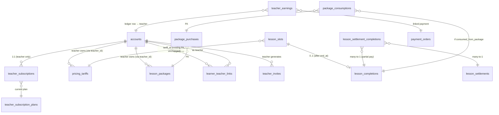

# SaaS-pivot master plan (2026-05-21)

**Status:** DRAFT — plan-paranoia rounds 1-16 closed (off-protocol per owner authorization).
**Author:** Claude (orchestrator-mode).
**Decision context:** chat session 2026-05-21 with product owner.

> Schema-survey companion doc: `docs/plans/saas-pivot-schema-survey.md` (research-only inventory).
> Landing-research inventory: `docs/plans/saas-pivot-landing-research-inventory.md`.

## 0. Plan-paranoia gate

This file MUST be sent through `/codex-paranoia plan` rounds 1-3 BEFORE any sub-PR opens.
Plan covers a multi-month epic-family — the BLOCKER bar is "would the implementation
of any sub-epic deadlock against another sub-epic's assumptions?"

### 0b. Round-2/3/4 closure table — pointer to authoritative body sections

Authoritative content lives in §2.x / §3 / §5 / §6. This table is a thin index of where
each historical BLOCKER was finally resolved. Body sections are SoT — if this table drifts
from body, body wins.

| # | Final body location | One-line summary |
|---|---|---|
| R2-1 | §2.9 | Bootstrap teacher account = 7-step row-MOVE migration: mint NEW pure-teacher inheriting prod email + password; swap OLD admin email to synthetic; revoke OLD sessions; re-point teacher-side rows + learner links; marker for idempotency. |
| R2-2 | §2.5 | Invite-redeem is the SOLE link-creation path. Booking surfaces return 403 if learner has no link. (Owner Q-7 confirmed.) |
| R2-3 | §2.6 | Forward+reverse Postgres triggers. 48h immutability enforced at the application layer (un-complete route), NOT CHECK — CHECK does not run on DELETE. |
| R2-4 | §2.7 | Immutable append-only ledger. Refund handler ALWAYS INSERTs `kind='clawback'` row. Sign-invariant CHECK. |
| R2-5 | §2.1 | Mig 0076 split into 0076a (Day 1 column add) → 0076c (Day 1 column add) → 0083 (Day 1 bootstrap backfill) → 0076b (Day 4 / Epic 3: drop global UNIQUE + add UNIQUE(teacher_id,slug) + NOT NULL). DDL order explicit; NOT-NULL/UNIQUE flips deferred out of Day 1 per round 14/15. |
| R2-6 | §2.2 ER + §3 Epic 2 + §3 Epic 3 | Canonical `pricing_tariffs` + `lesson_packages` extended with `teacher_id`. No `teacher_tariffs` / `teacher_packages` shadow tables anywhere. No FK rename. |
| R2-7 | §2.10 | Full scope matrix incl. `learner-book`, `learner-cancel`, `teacher-cancel`. Suspended teachers cannot cancel; learners can always rescue. |
| R2-8 | §5 | Day 5 → Day 5A (schema + UI + ALL writer refactor + cron-disable in same deploy) + Day 5B (debt-reader rewrite + cancel-after-complete interaction + reverse-trigger e2e test; cron is already disabled on 5A). 8-day MVP total. |

### 0a. Round-1 closure pointer table — body is SoT

Authoritative content lives in §2.x / §3 / §5. This table indexes where each historical
BLOCKER was finally resolved. Body wins on any drift.

| # | Final body location | One-line summary |
|---|---|---|
| 1 | §2.1 + §3 Epic 3 | Canonical `lesson_packages` + `package_purchases` extended with `teacher_id` (NOT shadow `teacher_packages` table). Buy route + grant/recon/debt all teacher-aware. |
| 2 | §2.1 + §2.4 + §3 Epic 2 | Canonical `pricing_tariffs` extended with `teacher_id` + `deleted_at`. No FK rename. Soft-delete via `deleted_at`; historical slot reads always JOIN unfiltered. |
| 3 | §2.5 | Explicit `getActiveTeacherForLearner()` contract. Invite-redeem is the SOLE link-creation path. Migration 0077 backfills single-link-per-learner from `assigned_teacher_id`. |
| 4 | §2.6 | `lesson_completions` REPLACES auto-cron. Slot status DERIVED via forward+reverse Postgres triggers. 48h immutability is application-layer (un-complete route), not CHECK. |
| 5 | §2.7 | Immutable append-only ledger. Refund handler INSERTs `clawback` row (never UPDATEs). Sign-invariant CHECK. |
| 6 | §2.8 + §2.1 mig 0085 | `/pay` keeps legacy direct-link compat via bootstrap-teacher credit; new teachers get `/t/<slug>/pay`. `payment_orders.teacher_account_id` added (mig 0085) + backfilled. |
| 7 | §2.9 | Bootstrap account = row-MOVE migration (mint NEW pure-teacher inheriting prod email/password; swap OLD admin email; revoke OLD sessions; re-point teacher-side rows + learner links). |
| 8 | §2.10 | Full scope matrix incl. `learner-book` + `learner-cancel` + `teacher-cancel`. Suspended teachers cannot cancel; learners can always rescue. |
| 9 | §2.11 | Phase-1 app-query discipline + CI grep guard. RLS deferred to phase-2 hardening epic. |
| 10 | §5 | Day 5 split into 5A/5B → 8-day MVP. Recurrent billing + public upgrades + payout tooling deferred to post-MVP epics. |

## 0z. Existing surface inventory (company-layer rule)

Grep commands run during plan drafting to discover the existing surfaces the pivot
touches (per company-layer `Survey-before-plan` rule). Companion docs have the full
breakdown:

- `docs/plans/saas-pivot-schema-survey.md` — `pricing_tariffs` / `lesson_packages` /
  `accounts.assigned_teacher_id` / `lesson_slots` consumer inventory.
- `docs/plans/saas-pivot-landing-research-inventory.md` — landing copy assets.

**Per-surface disposition** (NEW = create; EXTEND = touch existing module; KEEP = unchanged):

| Surface | Disposition | Rationale |
|---|---|---|
| `pricing_tariffs` table | EXTEND | Add `teacher_id` + `deleted_at`. No rename, no shadow table (R2-6). |
| `lesson_packages` table | EXTEND | Add `teacher_id`. Slug UNIQUE flips to composite (R2-5). |
| `package_purchases` | EXTEND | Add `teacher_id` (mig 0076c). |
| `payment_orders` | EXTEND | Add `teacher_account_id` (mig 0085). |
| `accounts` | EXTEND | Add `audit_email_history` + `teacher_account_migration_marker` (mig 0083). |
| `lesson_slots` | KEEP | Status enum unchanged; `teacher_account_id` re-pointed in mig 0083. |
| `teacher_subscription_plans` | NEW (mig 0073) | Reference table for plan-tier slugs. |
| `teacher_subscriptions` | NEW (mig 0074) | Per-teacher state. |
| `learner_teacher_links` | NEW (mig 0077) | n:m link backfilled from `assigned_teacher_id`. |
| `teacher_invites` | NEW (mig 0078) | HMAC token persistence. |
| `lesson_completions` | NEW (mig 0079) | Unified billable-event SoT. Triggers flip slot status. |
| `lesson_settlements` + `lesson_settlement_completions` | NEW (mig 0080) | M:N partial-pay support. |
| `teacher_earnings` + `teacher_earnings_payout_coverage` | NEW (mig 0081) | Append-only ledger + payout coverage join. |
| `/register?role=teacher` route | NEW | Plan-doc PR #339 drafted. |
| `/teacher/tariffs` page | NEW | Epic 2. |
| `/teacher/packages` page | NEW | Epic 3. |
| `/teacher/learners/[id]` page | NEW | Epic 5. |
| `/admin/teachers` + `/admin/teachers/[id]` | NEW | Epic 6. |
| `/admin/learners` | NEW | Epic 6. |
| `/admin/teachers/[id]/plan` | NEW | Plan-4 toggle UI (Epic 4-MVP). |
| `/admin/slots/[id]/mark` | EXTEND | Add dispatch on `kind` (Day 5A). |
| `lib/scheduling/slots/lifecycle.ts:markSlotLifecycle` | EXTEND | Dispatch billable kinds to `markLessonCompleted()`. |
| `scripts/auto-complete-slots.mjs` (`autoCompletePastBookedSlots`) | KEEP-then-DISABLE | Disabled in same deploy as mig 0079 (Day 5A). |
| `lib/billing/packages/debt.ts` | EXTEND | Switch to LEFT JOIN `lesson_completions` (Day 5B). |
| `lib/scheduling/teacher-learners.ts` | EXTEND | Same (Day 5B). |
| `lib/scheduling/slots/mutations-cancel.ts` | EXTEND | Reject cancel from `completed`/`no_show_learner` until un-mark (Day 5B). |
| `lib/auth/teacher-invites.ts` redeem CTE | EXTEND | Add `INSERT learner_teacher_links` to the atomic writable CTE. |
| `app/api/admin/refunds/route.ts` | EXTEND | Append clawback row on refund (Epic 5/6). |
| `app/checkout/package/[slug]/route.ts` | EXTEND | Add teacher-disambiguation (Epic 3). |
| `/` landing (current learner-targeted) | REPLACE | Becomes teacher-targeted in Epic 8. Old content moves to `/old` or deletes. |
| `/pay` route | KEEP | Legacy direct-link compat preserved; bootstrap teacher receives unattributed. |
| `/t/<teacher-slug>/pay` | NEW | New plan-4 teachers' direct-pay surface (Epic 6). |
| `/teacher/billing` | NEW (DEFERRED) | Epic 4-DEFERRED, post-MVP. |
| `account_profiles.teacher_public_slug` | NEW (mig 0086) | Source-of-truth for `/t/<teacher-slug>/pay` route. Backfilled `'level'` for bootstrap teacher in mig 0083. |

**Catalog-reader surface inventory (round-19 WARN #6 closure).** The catalog helpers
`listActiveTariffs()` + `getPackageBySlug()` are read from MORE places than the booking
flow alone. Each site MUST be either teacher-scoped or admin-global-annotated:

| Reader | File | Disposition |
|---|---|---|
| Teacher SSR landing on `/teacher` | `app/teacher/page.tsx:49` (`listActiveTariffs()`) | EXTEND — pass current teacher's id, filter by `teacher_id`. |
| Admin slots SSR | `app/admin/(gated)/slots/page.tsx:19-23` | EXTEND — admin-global, annotated `-- teacher-scope: admin-global`. |
| Public tariff checkout SSR | `app/checkout/[tariffSlug]/page.tsx:56-60` | EXTEND — passes tariff id; teacher derived FROM the tariff row's `teacher_id`. |
| Admin pricing API | `app/api/admin/pricing/route.ts:21-29` | EXTEND — admin-global, annotated. |
| `lib/pricing/tariffs.ts:121-156` `listActiveTariffs()` | core helper | EXTEND — accept `{ teacherId: string \| null }`, null → admin-global. |
| `lib/billing/packages/catalog.ts:43-77` `getPackageBySlug()` | core helper | EXTEND — accept `{ teacherId: string \| null }`; uses mig 0076b composite UNIQUE. |

No surface is silently extended. Every consumer listed above (booking-flow + catalog
readers + all writer surfaces in §2.5/§2.8 tables) is named in §3 Epics + §5 Day-by-day
plan.

## 1. Product context

### 1.1 The pivot in one sentence

LevelChannel today is a single-tenant **payment site** for one tutoring business
(ИП Фирсова). Pivot: become a **CRM tool for English tutors at large**, where:

- Teachers self-onboard, invite their own learners, manage their own tariffs + packages.
- We are **NOT a payment gateway by default** — most teachers handle money out-of-band
  (cash / direct transfer); the platform tracks completion + balance.
- A hidden **operator-managed tier** (plan-4) keeps the current CloudPayments flow for
  teachers who want us to be their payment processor (we take a commission, pay them out).

### 1.2 Subscription plans (teacher → operator)

Four plans:

| Plan | Price | Learner limit | Money flow through us |
|---|---:|---:|---|
| Free | 0 ₽ | 1 active learner | NO |
| Mid | 300 ₽/mo | 5 active learners | NO |
| Pro | 800 ₽/mo | 30 active learners | NO |
| Operator-managed | hidden | unlimited | YES — current CloudPayments flow + we take commission |

- Free is default after self-reg. Upgrade later in `/teacher/billing`.
- Plan-4 is operator-toggled in `/admin/teachers/[id]/plan` — not a public option.
- Downgrade is NOT allowed while `active_learner_count > new_plan.limit` — teacher must unlink learners first.
- Free tier has full feature parity (Google Calendar, TG reminders, tariffs, packages).
  Only knob is the `learner_count` cap.

### 1.3 Money flow recap

**Free/Mid/Pro learners — postpaid / package-paid only.**

- Postpaid: teacher marks "lesson completed" → learner sees accumulating balance owed.
  Teacher manually marks "paid" (full or partial sum). Platform does NOT touch money.
- Package: learner buys a package from teacher → **package consumption is debited at
  booking (NOT on completion)** — keeps the existing ledger semantics from migration
  0033 (`lib/scheduling/slots/booking.ts:220` consumes; `lib/scheduling/slots/mutations-cancel.ts:140`
  restores on slot cancel). Round-27 BLOCKER #1 closure: prior wording said "decrements
  on completion" which would have required a same-slot re-bind path that mig 0033
  explicitly forbids. The package_consumptions ledger is unchanged by the SaaS pivot;
  lesson_completions is a SEPARATE concept that tracks "проведено" status + earnings
  ledger entries, not package unit count. Un-mark of a completion does NOT restore the
  package consumption (consumption is bound to the booking, not the completion); only a
  slot CANCEL restores it. Debt query at §2.6 already filters out package-backed slots
  via `LEFT JOIN package_consumptions`. Same  payment-out-of-band rule for the package purchase itself (Mid/Pro teachers handle
  payment off-platform).

**Plan-4 learners — current CloudPayments flow.**

- `/pay` route stays — accepts ученическую оплату for operator-managed teachers.
- We hold the money, accrue a `teacher_earnings` ledger.
- Operator pays out the teacher (process is out-of-platform for v1; ledger is the SoT).
- Plan-4 commission rate TBD per teacher (single-knob per-teacher field).

## 2. Schema changes (additive to existing tables; no rename of FK columns)

### 2.1 Migration map (round-1 BLOCKERs 1+2+7 closures)

Key shift from the draft: **we extend existing tables with `teacher_id`** rather than
introduce parallel `teacher_tariffs` / `teacher_packages`. The canonical surface stays
the same name → minimum churn on the 20+ read-sites surfaced by schema-survey.

| # | Migration | Adds |
|---|---|---|
| `0073` | teacher_subscription_plans | Hardcoded reference table (4 rows: `free` / `mid` / `pro` / `operator-managed`). Plan limits + features. The slug `operator-managed` is canonical across schema + body + closures; never `operator`. |
| `0074` | teacher_subscriptions | Per-teacher current plan + renewal_at + state. |
| `0075` | pricing_tariffs.teacher_id + deleted_at | `add column teacher_id uuid NULL` + `add column deleted_at timestamptz`. **NOT NULL is deferred** to Epic 2 (Day 3), when the tariff-write surface is updated to pass `teacher_id`. Keeps Day 1 non-blocking for legacy writers. |
| `0076a` | lesson_packages.teacher_id (column add, nullable) | `alter table add column teacher_id uuid NULL`. NOT NULL deferred to mig 0076b which lands with Epic 3 writers. |
| `0076b` | lesson_packages.teacher_id (set + unique flip) | Runs in **Epic 3 (Day 4)**, after the catalog/purchases writers are teacher-aware. Drops the global `UNIQUE (slug)`; adds `UNIQUE (teacher_id, slug)`; sets NOT NULL. Three-statement DDL, single TX. |
| `0076c` | package_purchases.teacher_id (column add nullable) | Day 1. Backfill by mig 0083. Set NOT NULL in **Epic 3 / Day 4** alongside 0076b. Order: 0076c (Day 1) → 0083 (Day 1) → NOT NULL flip (Day 4, as part of 0076b deploy). |
| `0077` | learner_teacher_links | n:m link; `(learner_account_id, teacher_account_id) PK`, `linked_at`, `unlinked_at`, `via_invite_id`. Backfill from `accounts.assigned_teacher_id` (mig 0083). |
| `0078` | teacher_invites | HMAC-signed invite tokens (SAAS-3+4 plan-doc already drafted). |
| `0079` | lesson_completions + trigger pair + immutable_at | One row per "проведено" mark. FK to `lesson_slots(id)` + `pricing_tariffs(id)`. Forward trigger (insert→status=completed) + reverse trigger (delete→status=booked). `immutable_at` column for the 48h un-mark window. **REPLACES** the daily auto-complete cron. |
| `0080` | lesson_settlements + lesson_settlement_completions M:N | One row per "оплачено" mark. M:N join allows a single settlement to cover multiple partial-pay completions. |
| `0081` | teacher_earnings — append-only ledger | `accrued / paid_out / clawback` rows. Sign-invariant CHECK. Refund handler always inserts new `clawback` row (never UPDATEs). `related_completion_id` is a plain `uuid` on Day 1 (mig 0079 / Day 5A later adds the FK via ALTER TABLE — round-25 closure). `refund_reversal_id` FK → `payment_allocation_reversals(id)` (NOT `refund_records`, which does not exist in this repo). |
| `0083` | bootstrap teacher account + email swap + row migration | Mints NEW account inheriting prod email + password; renames OLD admin email to synthetic; revokes OLD sessions; re-points teacher-side data + learner links. **Also adds two columns to `accounts`: `audit_email_history jsonb DEFAULT '[]'` (records the email swap) + `teacher_account_migration_marker text NULL` (idempotency).** See §2.9 for the full 7-step TX. **Order-dependent: must run AFTER 0073-0078 + 0076a + 0076c + 0077 (all column-add migs), before 0076b (UNIQUE flip). Mig 0079 is independent — lands later on Day 5A.** |
| `0084` | (post-MVP) accounts.assigned_teacher_id retire | Drop the legacy column AFTER all read-sites are migrated to use `learner_teacher_links` or `getActiveTeacherForLearner()`. Deferred to a separate epic (not in 8-day MVP). |
| `0085` | payment_orders.teacher_account_id | `alter table payment_orders add column teacher_account_id uuid references accounts(id) NULL` in Day 1; backfill via slot/package linkage chain. **NOT NULL flip deferred to Epic 6 (Day 6)** when ALL FIVE payment_orders writers (§2.8 table) pass `teacher_account_id` at order creation. Index `(teacher_account_id, created_at desc)` for admin filters created in 0085 immediately. |
| `0086` | account_profiles.teacher_public_slug | `add column teacher_public_slug text null` + `unique` + `check (teacher_public_slug ~ '^[a-z0-9][a-z0-9-]{2,30}$')`. Source-of-truth for `/t/<teacher-slug>/pay` route (round-19 BLOCKER #3 closure — was previously absent from schema). **Runs BEFORE 0083** (round-20 BLOCKER #1 closure — Day-1 canonical order is 0086 → 0083). Bootstrap teacher backfilled to `'level'` by mig 0083 step 4; new plan-4 teachers pick their slug in `/admin/teachers/[id]/plan` toggle (Epic 6). Nullable for Free/Mid/Pro teachers (they have no /pay surface). |
| `0087` | payment_orders.granted_by_teacher_id + provider='teacher_grant' | Round-27 BLOCKER #2 closure: Free/Mid/Pro teacher-issued packages need a non-money writer path, but mig 0033 requires `package_purchases.payment_order_id NOT NULL`. Adds: column `granted_by_teacher_id uuid null references accounts(id) on delete restrict`; extends `payment_orders_provider_check` to allow `'teacher_grant'`; extends `payment_orders_status_check` to allow `'teacher_granted'` (active state) and `'teacher_revoked'` (round-29 closure — symmetric audit trail when a teacher voids an issued package); extends the existing triple-CHECK to a quadruple-CHECK so `provider='teacher_grant' ⇔ granted_by_teacher_id IS NOT NULL ⇔ status IN ('teacher_granted','teacher_revoked') ⇔ granted_by_operator_id IS NULL`. App-side gate: teacher actor in `/teacher/packages/[id]/issue` route writes a synthetic `payment_orders` row with `provider='teacher_grant'` + `status='teacher_granted'` + `granted_by_teacher_id=$session.teacherId`, then the `package_purchases` row references it (same shape as the existing admin-grant flow). Lands on Day 4 (Epic 3). |

### 2.4 Soft-delete semantics for tariffs (BLOCKER 2 closure)

Tariff lifecycle:
- `deleted_at IS NULL` — active, visible in teacher CRUD + bookable.
- `deleted_at IS NOT NULL` — hidden in teacher CRUD; ALL historical slot reads MUST still
  join via `LEFT JOIN pricing_tariffs t ON t.id = s.tariff_id` (no `WHERE deleted_at`).
  Slot history doesn't break: tariff name + price snapshot preserved.

Booking-time gate: slot creation MUST require `deleted_at IS NULL`. Helper
`assertTariffActive(tariffId)` added to `lib/pricing/tariffs.ts` — used by
`createSlot` + `bulkCreateSlots`. Existing `assertTariffDurationMatches` extended.

Read-site discipline:
- `lib/scheduling/slots/queries.ts:29` — keep LEFT JOIN, no filter.
- `lib/payments/slot-binding.ts:50` — keep current behaviour, no filter.
- `lib/billing/paid-state.ts:43` — keep, no filter.
- `lib/pricing/tariffs.ts` list-for-teacher: NEW — adds `WHERE deleted_at IS NULL`.
- `lib/pricing/tariffs.ts` admin list-all: NEW — `WHERE deleted_at IS NULL` by default,
  toggle to include archived.

### 2.5 Current-teacher context contract (BLOCKER 3 closure)

After `learner_teacher_links` table lands, every read-site that today does
`account.assignedTeacherId` MUST switch to ONE of three semantics:

- **"the active teacher"** (most cases) — helper `getActiveTeacherForLearner(accountId)`
  returns: (a) single link → that teacher's id; (b) multiple links → null + a discriminator
  flag (`needs_picker: true`); (c) zero links → null (legacy / unassigned).
  Routes that hit (b) MUST accept `?teacher=<id>` and validate it's in the learner's link set.

- **"any teacher"** (admin reads) — no filter, see all teachers.

- **"specific teacher"** (cabinet drill-down) — caller passes teacher_id from URL,
  validated against link set.

Affected read-sites (per schema-survey 2026-05-21 + round-19 BLOCKER #2 closure — full
audit, NOT just the 9 booking-flow consumers; original list was incomplete).

**Booking-flow reads (already in survey):**
- `app/api/slots/available/route.ts:17`
- `app/api/slots/booking-days/route.ts:26`
- `app/api/slots/booking-times/route.ts:21`
- `app/api/slots/[id]/book/route.ts:62`
- `app/cabinet/book/page.tsx:43`
- `app/cabinet/book/[ymd]/[slotId]/page.tsx:38`

**Additional consumers found in round-19 audit (MUST switch atomically same day):**
- `app/api/slots/calendar/route.ts:21-25,93-103` — current-teacher calendar SSR read.
- `app/cabinet/page.tsx:95-103,193-203` — cabinet shell + per-teacher block (Day 2 must
  render the n:m timeline shape from the start, even if v0 lists only one teacher when
  link-count = 1).
- `app/cabinet/lessons-section.tsx:34` — cabinet lessons section (round-20 WARN #3 closure
  — was missing from §2.5 inventory). Reads `account.assignedTeacherId` from the session
  account. **Covered by Day-2 back-compat alias** (`assignedTeacherIds[0]`); deeper rewrite
  to a per-teacher tab is part of Epic 7 cabinet n:m polish.
- `app/cabinet/settings/calendar/page.tsx:39-47` — learner-side calendar settings (already
  in original list as `:39`; re-confirmed `:39-47` is the full read window).
- `app/admin/(gated)/accounts/[id]/page.tsx:193-199` — admin learner drill-down.
- `lib/auth/sessions.ts:51-56,93-94` — **session hydration**. `assignedTeacherId` is read
  once at login + cached on the session row. Day-2 switch: replace single-value cache with
  `assignedTeacherIds: string[]` (`getActiveTeacherIdsForLearner()`). **Back-compat alias
  `assignedTeacherId = assignedTeacherIds[0] ?? null` is retained THROUGH the entire MVP**
  (Day 2 → post-MVP) so any single-value reader that gets missed during the Day-2 sweep
  still receives the first teacher's id. The alias + the `accounts.assigned_teacher_id`
  column itself are both dropped in mig 0084, which is **post-MVP** (round-20 WARN #2
  closure — was previously inconsistent: §2.1 says 0084 is post-MVP, §2.5 said alias drops
  on Day 6. Canonical: alias survives through MVP, drop with mig 0084 post-MVP.).
- `lib/scheduling/teacher-learners.ts:45-53` — teacher-learner summary query (currently
  joins on `assigned_teacher_id = $teacherId`; switches to join on `learner_teacher_links`).
- `lib/auth/accounts.ts:6` — **`Account` type definition** (`assignedTeacherId: string | null`).
  Type stays for the back-compat alias defined in `lib/auth/sessions.ts`. Round-20 WARN #3
  closure: the type-shape itself is intentionally preserved, not rewritten, to keep the
  single-value alias readable by any not-yet-rewritten consumer. New type-shape side-by-side:
  `assignedTeacherIds: string[]` added to `Account` in the Day-2 PR; both coexist until
  mig 0084 (post-MVP).

**Writers (separate from reads):**
- `lib/auth/accounts.ts:368` (assignTeacher mutation — re-purposed to write `learner_teacher_links`).
- `lib/auth/teacher-invites.ts:322-367` (invite redeem — currently a writable-CTE atomic
  statement that sets `assigned_teacher_id` + re-checks the teacher role in the same
  snapshot). Pivot **rewrites this single statement** to additionally INSERT a row into
  `learner_teacher_links` in the same writable CTE, so the race-free atomic guarantee
  (BLOCKER#1 from `teacher-self-reg-invite.md` round-3) is preserved. The
  `assigned_teacher_id` write stays during the dual-write release cycle.

**Dual-write contract.** During Day 2 → Day 6 window:
- All writers update BOTH `accounts.assigned_teacher_id` (back-compat) AND
  `learner_teacher_links` (canonical).
- All readers query `learner_teacher_links` via `getActiveTeacherForLearner()` /
  `getActiveTeacherIdsForLearner()`.
- Mig 0084 (drop of `accounts.assigned_teacher_id` + back-compat alias) is **post-MVP**
  per §2.1 deferred row — NOT in the 8-day cut. Session-cache shape change to
  `assignedTeacherIds[]` IS Day-2 atomic; the column itself + the back-compat alias both
  outlive MVP until a follow-up epic.

These ALL change atomically in Epic 1 (NOT deferred to Epic 7). Backfill from
`assigned_teacher_id` → `learner_teacher_links` is one-to-one for v1.

### 2.6 lesson_completions vs slot.status — full bi-directional contract (R2-3 closure)

Existing world: `lesson_slots.status` includes `'completed'`. A daily auto-complete cron
flips `'booked'` → `'completed'` after end_at. Debt + teacher-learner summaries read this.

New world: `lesson_completions` is the source of truth. `slot.status` is DERIVED.

**Schema invariants (mig 0079 — round-19 BLOCKER #4 closure):**

```sql
create table lesson_completions (
  id uuid primary key default gen_random_uuid(),
  slot_id uuid not null references lesson_slots(id) on delete restrict,
  teacher_id uuid not null references accounts(id),
  was_no_show boolean not null default false,
  amount_kopecks integer not null,
  completed_at timestamptz not null,
  immutable_at timestamptz null,
  marked_by_account_id uuid null references accounts(id),
  created_at timestamptz not null default now(),
  -- Round-19 BLOCKER #4: prevents double-completion via concurrent teacher/admin marks
  -- or any double-submit. Without this, the forward trigger happily leaves
  -- lesson_slots.status='completed' but debt/settlement double-counts.
  constraint lesson_completions_slot_uniq unique (slot_id)
);
```

`markLessonCompleted({slotId, teacherId, wasNoShow})` writes with a single TX that performs
THREE steps (round-26 BLOCKER #2 closure — was previously only step 3):

1. **Lock the slot row**: `select id, status, end_at, teacher_account_id from lesson_slots
   where id = $slotId for update`. Without the row lock, a concurrent cancel could flip
   status between the eligibility-check and the insert.
2. **Eligibility gate** (raises 409, no insert):
   - `lesson_slots.teacher_account_id = $teacherId` — anti-spoof, helper does NOT trust
     the caller's `teacherId` against the slot.
   - `lesson_slots.status = 'booked'` — completed/cancelled/open slots are rejected.
   - `lesson_slots.end_at <= now()` — future slots are rejected (state machine in §2.3:
     "end_at passes → eligible for проведено mark"). Without this gate, a teacher (or
     admin tooling) could insert a `lesson_completions` row for a future slot; the
     forward trigger would no-op (because status is `booked` but the slot has not yet
     ended), yet debt/settlement queries would still find the completion row and treat
     it as real money owed. Closes the silent-row failure mode that round-26 surfaced.
3. **Insert with conflict semantics**: `INSERT ... ON CONFLICT (slot_id) DO NOTHING
   RETURNING id`. Caller checks the RETURNING shape:
   - 1 row → fresh completion (forward trigger flipped status to `completed` / `no_show_learner`).
   - 0 rows → row already exists. Caller does NOT raise; idempotent semantics. Caller MAY
     read back the existing row to confirm `was_no_show` matches; mismatch is logged as a
     WARN (concurrent admin override) but not raised — last writer loses, first writer wins.

The 3-step contract is enforced in the helper, NOT scattered across callers. All four
billable-event writers (teacher self-mark UI, admin route, automation if/when re-enabled,
plan-4 webhook auto-settle path) go through this single helper.

**Triggers (Postgres):**

```sql
-- Forward: insert completion → flip status to derived target.
-- was_no_show=false → status='completed'; was_no_show=true → status='no_show_learner'.
create or replace function lesson_completion_apply() returns trigger as $$
begin
  update lesson_slots
     set status = case when new.was_no_show then 'no_show_learner' else 'completed' end,
         updated_at = now()
   where id = new.slot_id and status = 'booked';
  return new;
end$$ language plpgsql;
create trigger lesson_completion_apply_t
  after insert on lesson_completions
  for each row execute procedure lesson_completion_apply();

-- Reverse: delete completion → flip status back to 'booked' from either terminal state.
create or replace function lesson_completion_revert() returns trigger as $$
begin
  update lesson_slots
     set status = 'booked', updated_at = now()
   where id = old.slot_id and status in ('completed', 'no_show_learner');
  return old;
end$$ language plpgsql;
create trigger lesson_completion_revert_t
  after delete on lesson_completions
  for each row execute procedure lesson_completion_revert();
```

`markLessonCompleted({slotId, teacherId, wasNoShow})` helper signature accepts a
`wasNoShow` boolean. All four writers pass this kind through; the trigger uses
`was_no_show` to derive the target status. `no_show_learner` is therefore set
indirectly via the trigger, NOT by direct status write. After Day 5A: no writer
sets `status='completed'` or `status='no_show_learner'` directly — only the
trigger does. `status='no_show_teacher'` remains a direct write (no completion
row, not billable, separate path through existing `mark-no-show-teacher`
mutation).

**48h immutability + financial-link guard (round-26 BLOCKER #1 closure).** Postgres CHECK
does not fire on DELETE, so un-mark is gated app-side AND DB-side. The route now blocks
a delete if ANY of three conditions hold (was previously 48h only):

```ts
// app/api/teacher/lessons/[id]/uncomplete/route.ts
async function POST(req) {
  // Gate (under FOR UPDATE row lock on the completion row):
  // (1) validate teacher ownership.
  // (2) validate created_at > now() - 48h → if older 409 immutable.
  // (3) check any lesson_settlement_completions row exists for this completion → if yes,
  //     409 settled (settlement already counted this completion; un-mark would lose the
  //     financial trail or FK-fail).
  // (4) check any teacher_earnings.related_completion_id = $id → if yes, 409 accrued
  //     (plan-4 path: ledger row exists; un-mark would orphan it).
  // If all gates pass → DELETE lesson_completions WHERE id = $1 (trigger flips slot back
  // to booked). Compensating reversal flow is NOT implemented in MVP — once money has
  // moved, the un-mark window is closed even if still < 48h.
}
```

**DB-side defense-in-depth (mig 0079).** BEFORE DELETE trigger raises an exception when
ANY of: `OLD.immutable_at IS NOT NULL` (48h elapsed), `EXISTS(select 1 from
lesson_settlement_completions where completion_id = OLD.id)`, or
`EXISTS(select 1 from teacher_earnings where related_completion_id = OLD.id)`. Three
independent guards; the application-side route is the friendly-error layer, the trigger
is the safety net against direct SQL DELETE.

Daily retention sweep `scripts/db-retention-cleanup.mjs` is updated to mark
`lesson_completions.immutable_at = created_at + 48h` once that timestamp passes.

**Cancel-after-completion contract:**

`lib/scheduling/slots/mutations-cancel.ts` currently allows learner cancel on
`status='booked'` and teacher cancel on `status in ('open','booked')`. The pivot extends:

- Teacher cancel from `status='completed'` is REJECTED with 409 — they must un-mark first
  (within 48h window). After 48h, the slot is settled; cancel is no longer meaningful.
- Learner cancel from `status='completed'` is REJECTED with 409 — same reason.
- Un-mark → reverse trigger sets `status='booked'` → cancel then works normally.

Two-step un-mark-then-cancel is by design. Documentation in `/teacher` cabinet UI surfaces
this: a "completed" lesson shows two buttons "Не было занятия (отменить отметку)" → reverts
to booked + a separate "Отменить занятие".

**no_show_* states + debt bridge.** Existing slot status enum includes `no_show_learner`
and `no_show_teacher`. Current prod billing semantics:
- `no_show_learner` → IS BILLABLE (learner skipped — they still owe). Current debt query
  at `lib/billing/packages/debt.ts:49,133` counts `status IN ('completed','no_show_learner')`.
- `no_show_teacher` → NOT billable (teacher's fault).

Pivot preserves this contract. To keep `lesson_completions` as a single source of truth
for debt, BOTH historical backfill AND runtime status-flips funnel into completion rows:

- Mig 0079 schema adds `was_no_show` boolean column (default false) on `lesson_completions`.
  ```sql
  alter table lesson_completions
    add column was_no_show boolean not null default false;
  ```
- **Historical backfill (mig 0079, runs once):** for every `lesson_slots WHERE status='completed'`
  insert a row with `was_no_show=false`. For every `lesson_slots WHERE status='no_show_learner'`
  insert a row with `was_no_show=true`. `amount` snapshot from current tariff price.
  `no_show_teacher` rows are NOT backfilled (still not billable).
- **Runtime status-flip via the unified helper.** The existing `mark-no-show-learner`
  mutation in `lib/scheduling/slots/lifecycle.ts:markSlotLifecycle` is refactored to call
  `markLessonCompleted({slotId, teacherId, wasNoShow: true})`. Helper only INSERTs the
  completion row; the forward trigger derives the status from `was_no_show` (→
  `'no_show_learner'`). No direct status write in this path after Day 5A.
- **`no_show_teacher` UPDATE** still goes through `mark-no-show-teacher` mutation,
  writes `status='no_show_teacher'` directly, no completion row (not billable).
- Debt query at Day 5B rewrites to read `lesson_completions` directly — covers both
  completed-on-time + no-show-billable via the unified table.

End state: every billable lesson event (whether "проведено" or "no_show_learner") writes a
`lesson_completions` row. The SoT is unified.

**Migration sequence:**

1. Mig 0079 creates `lesson_completions` + both triggers + `immutable_at` column.
2. Backfill: for every `lesson_slots WHERE status='completed'` insert a row with
   `amount` snapshot from current tariff price + `completed_at = end_at` +
   `immutable_at = now()` + `was_no_show=false`. For every `status='no_show_learner'`
   insert a row with the same amount/timestamp + `was_no_show=true`.
   `marked_by_account_id = NULL` (synthetic). `status='no_show_teacher'` rows NOT backfilled
   (not billable).
3. Auto-complete cron DISABLED in the same epic (per Owner Q-2 decision).
4. Debt read at `lib/billing/packages/debt.ts:41` switches to LEFT JOIN `lesson_completions`.
5. `teacher-learners.ts:29` similarly.
6. `mutations-cancel.ts` extended with the `'completed'` rejection rules.
7. `lesson_slots.status` enum keeps `'completed'` + `'no_show_*'` values. THREE
   billable-event writers go through a unified `markLessonCompleted()` helper that
   inserts the completion row first, then the forward trigger flips the slot's status.
   Writers: (a) teacher mark UI, (b) admin mark route `/api/admin/slots/[id]/mark`
   via `lib/scheduling/slots/lifecycle.ts:markSlotLifecycle` with dispatch:
   `kind in ('completed','no_show_learner')` → helper, `kind='no_show_teacher'` →
   direct write. (c) daily auto-complete cron `scripts/auto-complete-slots.mjs`
   (`autoCompletePastBookedSlots` in `lib/scheduling/slots/lifecycle.ts:55`) is
   DISABLED in the same deploy that ships mig 0079 — per owner Q-2 "manual only in
   MVP", consistent with Day 5A. `no_show_teacher` mutation in `markSlotLifecycle`
   stays as a direct status write — not billable, no completion row.

Epic 5 implementation note: split into 5A (schema 0079/0080 + triggers + 48h
immutability + teacher UI to mark complete + cabinet read + ALL writer refactor
+ cron disable in same deploy) and 5B (debt-reader rewrite + cancel-after-complete
interaction + reverse-trigger end-to-end test). Cron-disable is NOT in 5B.

### 2.7 teacher_earnings — append-only ledger (R2-4 closure)

**Append-only, never UPDATE.** Three row kinds:

| Kind | `amount_net` sign | Meaning |
|---|---|---|
| `accrued` | positive | Learner paid; teacher's share booked. |
| `paid_out` | negative | Operator paid the teacher; reduces balance. |
| `clawback` | negative | Refund of a learner payment (refund of an `accrued` or `paid_out` row); reduces balance. May make total balance go negative if payout already happened. |

**Balance formula:** `SUM(amount_net) GROUP BY teacher_account_id`. Always derivable from
the ledger. Negative balance = operator overpaid (needs recovery — UI surfaces it).

**Migration 0081 schema (two tables — ledger + payout coverage):**

```sql
create table teacher_earnings (
  id uuid primary key default gen_random_uuid(),
  teacher_account_id uuid not null references accounts(id),
  kind text not null check (kind in ('accrued','paid_out','clawback')),
  amount_net numeric(10,2) not null,
  -- For accrued: positive amount. For paid_out / clawback: negative.
  payment_order_id text references payment_orders(invoice_id),
  -- Set on accrued + clawback (links to the source payment).
  -- Round-25 BLOCKER #1 closure: `refund_records` does NOT exist in this repo. The
  -- canonical refund SoT is `payment_allocation_reversals` (migration 0036).
  refund_reversal_id uuid references payment_allocation_reversals(id),
  -- Set on clawback rows only.
  -- Round-25 BLOCKER #1 closure: `lesson_completions(id)` does NOT exist on Day 1
  -- (mig 0079 lands on Day 5A). The FK is added by ALTER TABLE in mig 0079, not here.
  -- This column is plain UUID on Day 1; mig 0079 (Day 5A) runs
  -- `alter table teacher_earnings add constraint teacher_earnings_completion_fk foreign key (related_completion_id) references lesson_completions(id)`.
  related_completion_id uuid,
  related_accrued_id uuid references teacher_earnings(id),
  -- Clawback rows link to the original accrued row they reverse.
  created_at timestamptz not null default now(),
  check (
    (kind = 'accrued' and amount_net > 0)
    or (kind in ('paid_out','clawback') and amount_net < 0)
  )
);

-- A payout row aggregates N accrued rows. Many-to-many join.
create table teacher_earnings_payout_coverage (
  payout_id uuid not null references teacher_earnings(id) on delete cascade,
  accrued_id uuid not null references teacher_earnings(id) on delete cascade,
  primary key (payout_id, accrued_id)
);

create index teacher_earnings_balance_idx on teacher_earnings (teacher_account_id, created_at desc);
create index teacher_earnings_accrued_unpaid_idx on teacher_earnings (teacher_account_id) where kind = 'accrued';
```

When operator pays out: INSERT one `paid_out` row (negative amount_net = sum of selected accrued); INSERT N rows in `teacher_earnings_payout_coverage` pairing the payout row's id with each covered accrued's id.

**Canonical queries:**

```sql
-- current_balance for a teacher
select coalesce(sum(amount_net), 0)
  from teacher_earnings
 where teacher_account_id = $1;

-- accrued rows eligible for the next payout batch
-- Round-22 BLOCKER #2 closure: partial-refund support. An accrued row
-- is payable on the NET remaining after partial clawbacks (not just
-- "any clawback → exclude"). Pre-fix logic excluded the entire accrued
-- on the first clawback row, even if the clawback was partial.
select e.id,
       e.amount_net + coalesce(c.clawed_back, 0) as net_remaining,
       e.payment_order_id
  from teacher_earnings e
  left join lateral (
    select sum(amount_net) as clawed_back
      from teacher_earnings c
     where c.kind = 'clawback'
       and c.related_accrued_id = e.id
  ) c on true
 where e.teacher_account_id = $1
   and e.kind = 'accrued'
   and e.amount_net + coalesce(c.clawed_back, 0) > 0
   and not exists (
     select 1 from teacher_earnings_payout_coverage cov
      where cov.accrued_id = e.id
   );
```

**Refund handler (`app/api/admin/refunds/route.ts:178-207`):** after writing the refund row,
ALWAYS insert a new `kind='clawback'` row with **`amount_net = -refund.amount_kopecks/100`**
(the actual refunded amount, NOT the full accrued amount — round-22 BLOCKER #2 closure:
the existing refund route at `:178-207` supports partial refunds gated by
`prior + this <= allocation`; clawback'ing the full accrued on a partial refund would
over-debit the teacher). `refund_reversal_id = $newReversalId` (FK to `payment_allocation_reversals(id)` — round-25 closure: not `refund_records`, which does not exist in this repo), `related_accrued_id = $originalAccruedId`.
A single accrued row CAN have N clawback rows from N partial refunds; the eligible-for-payout
query already handles this (`select e where not exists clawback c.related_accrued_id = e.id`)
needs an update: it currently treats ANY clawback as full reversal. Updated query in §2.7:
`accrued_after_clawback(e) = e.amount_net + sum(clawback.amount_net where related_accrued_id = e.id)`;
include in payout if `accrued_after_clawback(e) > 0` AND `NOT EXISTS payout_coverage`. The
"if balance < 0 → alert operator" rule still holds for cumulative deficit. **Never UPDATE
the original accrued row.**

**Day 6 ledger UI:** uses the canonical queries above. "Current balance" = SUM; "Eligible
for payout" = filtered list; "Negative balance teachers" = SUM < 0 group.

### 2.8 /pay surface for plan-4 + legacy direct-link compat (R2-2 closure)

`/pay` stays generic at the surface; the **teacher inference** happens at order
creation time. Four derivation paths:

1. **slot-paid via `metadata.slotId`** (current) — derive teacher from
   `lesson_slots.teacher_account_id` already on the slot. Already shipped.
2. **package-paid via `metadata.packageId`** — derive teacher from `lesson_packages.teacher_id`
   (column added in mig 0076a; UNIQUE flip to `(teacher_id, slug)` happens later in mig 0076b
   on Day 4 / Epic 3). **Canonical identifier is `metadata.packageId`, NOT `metadata.packageSlug`**
   — round-28 BLOCKER #1 closure: post-mig-0076b a slug is only unique within a teacher,
   so the existing webhook path (`app/api/payments/webhooks/cloudpayments/pay/route.ts:156`)
   + grant path (`lib/billing/package-grant.ts:160` → `lib/billing/packages/catalog.ts:71`
   `where slug = $1`) would become non-deterministic. Checkout already writes both
   `packageSlug` AND `packageId` (`app/api/checkout/package/[slug]/route.ts:113`). Day-4
   sweep: every fulfillment site MUST switch to `getPackageById(metadata.packageId)`;
   `getPackageBySlug` callers either pass a teacher_id discriminator or get deprecated.
   Checkout route also updated to accept `?teacher=` query param OR to derive from the
   current learner's single-active link if unambiguous; if ambiguous (multi-link), 400
   with reason.
3. **legacy direct-link top-up** (no slot/package, just `amount + email`) — **PRESERVED**
   for backward compat. These orders are credited to the bootstrap plan-4 teacher account
   (the only plan-4 holder at v1 launch). When a NEW teacher gets plan-4, their direct-link
   form lives at `/t/<teacher-slug>/pay` (new route in Epic 6); the global `/pay` form
   continues to credit the bootstrap teacher unless a teacher slug query is present.
   No backward break for shared invoice links already in the wild.
4. **direct top-up at a non-bootstrap teacher** — requires `/t/<teacher-slug>/pay` route
   so the teacher_account_id is unambiguous at order creation. **Slug source-of-truth**:
   mig 0086 adds `account_profiles.teacher_public_slug TEXT UNIQUE` (nullable, allowlist
   `/^[a-z0-9][a-z0-9-]{2,30}$/`) on Day 1 — runs BEFORE mig 0083 in the canonical order;
   bootstrap teacher gets `'level'` in mig 0083 step 4 (so existing direct-link `/pay`
   becomes equivalent to `/t/level/pay`). Lookup path:
   `select id from accounts join account_profiles using(id) where account_profiles.teacher_public_slug = $1`,
   then validate the account holds a `teacher` role + plan-4 `teacher_subscriptions` row.
   Public-collision risk: slug uniqueness + allowlist prevents spoofing; no slug → 404.

Backfill is in **mig 0085** (NOT 0083): mig 0085 adds `payment_orders.teacher_account_id`
as nullable on Day 1 and backfills via the slot/package linkage chain. Orders without
linkage → bootstrap plan-4 teacher account (logged in audit history). Mig 0083 (bootstrap
row-MOVE) runs first; 0085 depends on the bootstrap account being in place. Order:
0083 → 0085. **NOT NULL flip is deferred to Epic 6 (Day 6)** when EVERY writer below
passes `teacher_account_id` — round-19 BLOCKER #1 closure: the flip was previously tied
only to `/api/payments`, but the full writer surface is broader. **All `payment_orders`
writers (must ALL be updated in Epic 6 BEFORE the NOT NULL flip):**

| Writer | File | Day-6 work |
|---|---|---|
| Card-widget order creation | `/api/payments` (`buildCloudPaymentsWidgetIntent` → `store.create`) | Pass `teacher_account_id` from slot/package derivation or `?t=<slug>` query. |
| Package checkout | `app/api/checkout/package/[slug]/route.ts:185-224` | Derive from `lesson_packages.teacher_id` (mig 0076a) — pass into `store.create`. |
| Admin package grant | `app/api/admin/packages/[id]/grant/route.ts:271-287` | Derive from package; pass through. |
| SBP-QR create | `app/api/payments/sbp/create-qr/route.ts:221-250` | Derive from slot/package; pass through. |
| **Saved-card one-click** (round-22 BLOCKER #1 closure) | `app/api/payments/charge-token/route.ts:138-151` → `chargeWithSavedCard()` → `lib/payments/provider/checkout.ts:147-175` (`createOrder`) | Derive from slot/package metadata (same paths as `/api/payments`); pass `teacher_account_id` into `createOrder`. Without this, one-click payments would fail the Day-6 NOT NULL flip. |
| Shared store-postgres | `lib/payments/store-postgres.ts:223-247` + `lib/payments/types.ts:57-99` + `lib/payments/provider/checkout.ts:46-95,147-175` | **Contract update: `PaymentOrder` type + `store.create()` + `createOrder()` signatures accept `teacherAccountId: string \| null`. Type-level default is null during the dual-write window; flip to required after all SIX callers pass it.** |

Mig 0085 backfill chain (Day 1 nullable): (a) for orders WITH `metadata.slotId` → join
`lesson_slots.teacher_account_id`; (b) for orders WITH `metadata.packageSlug` → join
`lesson_packages.teacher_id` (already backfilled by mig 0083); (c) all other orders →
bootstrap teacher. Mig 0085 also reports the per-bucket count via `RAISE NOTICE` so the
deploy log shows backfill coverage. Day-6 NOT NULL flip is then safe.

`/api/payments` validates the inferred `teacher_account_id` against
`teacher_subscriptions` — only plan-4 teachers' orders accepted. Mid/Pro/Free teachers do
NOT get a `/pay` surface; their learners pay them out-of-band.

### 2.9 Bootstrap teacher account — 7-step row migration (R2-1 closure)

The current production account (let's call it `OLD`) has BOTH admin role AND has been the
implicit teacher for every slot/integration/Telegram binding. The role model forbids
hybrid admin+teacher.

The migration is **a row-move, not a synthetic-account split**:

**Migration 0083 (single TX, order matters because `accounts.email` is UNIQUE):**

1. **Rename OLD's email FIRST** to a synthetic `admin-2026-05-21@levelchannel.internal`.
   This frees up the real email for the NEW account. The OLD account stays as admin-only;
   its old email is preserved in `accounts.audit_email_history` (new jsonb column added
   in 0083 for traceability). UNIQUE index allows the swap because OLD's row updates
   before NEW's INSERT.

2. **Mint NEW account** `NEW`:
   - Email: the now-freed REAL email (Анастасия's working email).
   - Role: `teacher` only.
   - `password_hash`: copy from `OLD` (so the teacher can log in with the same password).
   - **`email_verified_at`: copy from OLD** (round-23 BLOCKER #1 closure — `/teacher`
     layout at `app/teacher/layout.tsx:46-47` redirects unverified accounts to `/cabinet`.
     If `email_verified_at = NULL` on NEW, Анастасия logs in and lands on the learner
     cabinet, not `/teacher`. OLD was verified, so the email itself is verified — copy
     the timestamp to preserve that.).
   - Subscription: `plan='operator-managed'` immediately (the only plan-4 holder at boot).

3. **Revoke OLD's teacher role grant** (if present in `account_roles`). OLD is now
   admin-only.

4. **Revoke ALL active sessions on OLD** — write to `account_sessions` setting
   `revoked_at = now()`. The teacher will need to re-log on the new email.
   (Acceptable — one-time inconvenience for clean migration.)

4a. **Mass-consume outstanding single-use auth tokens on OLD** (round-24 BLOCKER closure
    — single-use tokens are `account_id`-bound, NOT email-bound):
    ```sql
    update password_resets    set consumed_at = now() where account_id = OLD.id and consumed_at is null;
    update email_verifications set consumed_at = now() where account_id = OLD.id and consumed_at is null;
    ```
    Rationale: any stale `password-reset` / `verify-email` link previously sent to the
    REAL mailbox (which is about to become NEW's email) would otherwise still authenticate
    into OLD after the row-move — `lib/auth/single-use-tokens.ts:36,80` mints/consumes by
    `account_id`, and `app/api/auth/reset-confirm/route.ts:56-69` + `verify/route.ts:43-49`
    both create a session for the consumed token's `account_id`. Marking all OLD-bound
    tokens consumed in the same TX as the email swap closes that window. Anastasiya / Ivan
    will need to request fresh reset/verify links post-migration if needed.

5. **Re-point teacher-side data from OLD to NEW** (round-22 BLOCKER #3 closure —
   expanded inventory + corrected `teacher_calendar_integrations` column name):
   - `lesson_slots.teacher_account_id = OLD.id` → `NEW.id`.
   - `pricing_tariffs.teacher_id = NULL` → `NEW.id` (column from mig 0075 backfills here;
     this is what makes Epic 2 statement "bootstrap teacher owns all legacy tariffs" hold).
   - `lesson_packages.teacher_id = NULL` → `NEW.id` (column from mig 0076a; later 0076b
     drops the global UNIQUE and adds the composite).
   - `package_purchases.teacher_id` filled from `lesson_packages.teacher_id`. Column already
     added by mig 0076c (Day 1, before 0083); NOT NULL flip lands later in Epic 3 (Day 4).
   - `teacher_calendar_integrations.account_id` → repoint. (Table is keyed by
     `account_id`, not `teacher_account_id` — per `migrations/0043_teacher_calendar_integrations.sql:21`.
     Pre-fix said `teacher_account_id` which does not exist on this table.)
   - `teacher_external_busy_intervals.teacher_account_id` → repoint
     (`migrations/0044_teacher_external_busy_intervals.sql:29`). Busy cache fed by Google
     pull job; if not repointed, conflict detection still flags OLD's events against
     NEW's slots, but the table key would orphan.
   - `calendar_push_jobs.teacher_account_id` + `calendar_pull_jobs.teacher_account_id` →
     repoint (`migrations/0045_calendar_jobs.sql:27,95`). Both have `ON DELETE CASCADE`
     from accounts, so missing repoint + OLD account modification triggers no row-loss,
     but live in-flight jobs would silently target OLD which now has no `teacher` role.
   - `teacher_invites.teacher_account_id` → repoint
     (`migrations/0057_teacher_invites.sql:23`). Without this, any outstanding invite
     links Анастасия generated would still point at OLD; the redeem-CTE re-checks
     `account_roles` and would reject because OLD no longer holds `teacher` role
     (closes a real "all your existing invite URLs go 409" footgun).
   - `accounts.teacher_telegram_*` columns: copy `OLD`'s values to `NEW`, NULL on `OLD`.
   - `teacher_account_daily_digests.account_id` → repoint (history preserved).
   - `learner_reminder_dispatches.*` rows linked via teacher_id → repoint.
   - **Verification grep** before shipping mig 0083: `grep -RnE "teacher_account_id|teacher_id"
     migrations/ | awk -F: '{print $1}' | sort -u` against the §0z disposition map. Any
     teacher-bound table NOT in the list above MUST be added before the mig runs.

5a. **Re-point `account_profiles` row from OLD to NEW + set `teacher_public_slug='level'`**
   (round-21 BLOCKER closure — was previously missing; `account_profiles` is a separate
   table keyed by `account_id`, not auto-created by `createAccount`, so the bootstrap row
   needs explicit handling). Mig 0017 created `account_profiles` 1:1 with accounts but
   profile rows are NOT auto-minted on `createAccount`. Two sub-steps:
   - `update account_profiles set account_id = NEW.id, teacher_public_slug = 'level' where account_id = OLD.id`
     — moves Анастасия's existing display_name/timezone/locale to the NEW teacher row.
   - `insert into account_profiles (account_id, display_name, timezone, locale)
        values (OLD.id, 'admin', 'Europe/Moscow', 'ru')
        on conflict (account_id) do nothing` — backfills a minimal admin profile on OLD
     (round-23 BLOCKER #2 closure: `account_profiles.locale` CHECK constraint at
     `migrations/0017_account_profiles.sql:33-34` allows only `'ru'` or NULL — was
     previously `'ru-RU'` which would fail the constraint and abort mig 0083)
     (OLD is admin-only now and has no teacher-facing surface, so display_name/timezone
     are nominal). The `on conflict` is defensive: if mig 0017's FK + cascade behaviour
     ever leaves a half-state on OLD, the INSERT no-ops.
   After step 5a: the bootstrap NEW has the teacher's real display_name + locale + tz +
   the canonical `teacher_public_slug='level'`. OLD has a synthetic admin profile.

6. **Re-point learner links**: every `assigned_teacher_id = OLD.id` → `NEW.id`. Insert
   `learner_teacher_links(learner_account_id, teacher_account_id=NEW.id, linked_at=now())`
   for each such learner. (Mig 0077 created the table empty; this is its initial backfill.)

7. **Mark migration done**: `accounts.teacher_account_migration_marker = 'bootstrap-2026-05-22'`
   on `NEW`. Idempotency: re-running 0083 finds the marker and exits no-op.

**Result:** Анастасия logs in with her real email + password — gets routed to `/teacher`
because her account is teacher-only now. The OLD admin login (different email after step 2)
is used ONLY by Иван to administer the platform. Sessions need re-login (one-time cost).

**Caveat:** there's a small window between mig 0083 START and END where existing OLD
sessions are still valid but route gates may flip. Mitigation: run migration in
maintenance mode (5-minute downtime banner on `/`) — this is a one-shot, not recurring.

### 2.10 past_due / cancelled gates — full scope matrix (R2-7 closure)

Subscription state per teacher impacts both teacher-side and learner-side routes:

| State | invite | slot-write | tariff-write | completion-write | learner-book | learner-cancel | teacher-cancel |
|---|:---:|:---:|:---:|:---:|:---:|:---:|:---:|
| Free + within cap | ✅ (cap=1) | ✅ | ✅ | ✅ | ✅ | ✅ | ✅ |
| Free + over cap | ❌ | ✅ | ✅ | ✅ | ✅ | ✅ | ✅ |
| Mid/Pro active | ✅ (cap) | ✅ | ✅ | ✅ | ✅ | ✅ | ✅ |
| past_due (≤3 days) | ❌ | ❌ | ✅ | ✅ | ✅ existing | ✅ | ✅ |
| past_due (>3 days) | ❌ | ❌ | ❌ | ❌ | ❌ | ✅ | ✅ |
| cancelled — within Free cap | ✅ (cap=1) | ✅ | ✅ | ✅ | ✅ | ✅ | ✅ |
| cancelled — over Free cap | ❌ | ✅ | ✅ | ✅ | ✅ | ✅ | ✅ |
| suspended | ❌ | ❌ | ❌ | ❌ | ❌ | ✅ | ❌ |

**Scope helpers:** `requireActiveSubscription(scope, teacherAccountId)` wraps every write
route. Scopes:

- `invite` — `app/api/teacher/invites/route.ts:20`.
- `slot-write` — `app/api/teacher/slots/route.ts:20`, `app/api/teacher/slots/bulk-create/route.ts:20`.
- `tariff-write` — `/api/teacher/tariffs/*` CRUD (new in Epic 2).
- `completion-write` — `/api/teacher/lessons/[id]/complete` + `/uncomplete` (Epic 5).
- `learner-book` — `app/api/slots/available/route.ts:17`, `app/api/slots/booking-days/route.ts:26`,
  `app/api/slots/booking-times/route.ts:21`, `app/api/slots/[id]/book/route.ts:62`. Helper
  receives the slot's `teacher_account_id` and checks if that teacher's plan supports new
  bookings.
- `learner-cancel` — `app/api/slots/[id]/cancel/route.ts` learner branch. ALWAYS allowed
  (even if teacher is suspended) — learner can always rescue their commitment.
- `teacher-cancel` — `app/api/teacher/slots/[id]/route.ts` cancel branch. Suspended teachers
  cannot cancel; operator must do it via admin.

Cancel-while-past-due: existing booked slots remain cancellable by both sides. Completion-
write disabled means the teacher can't accrue NEW debt against a learner whose teacher is
in arrears. Net effect: a past_due teacher is "frozen in place" — their schedule keeps
running, but no new commitments form.

Suspended (operator action) is harder — `teacher-cancel` is blocked because suspension is
typically used after a terms violation; we want operator-only resolution.

### 2.11 Multi-tenant query discipline (WARN 9 closure)

Phase-1 (this epic): app-query discipline + CI grep guard.

- Centralized helper `lib/auth/teacher-scope.ts:requireTeacherScope(query, teacherId)`
  for every multi-tenant SELECT / UPDATE / DELETE.
- New `scripts/check-teacher-scope.sh` greps the full set of tenant-owned tables — round-19
  WARN #5 closure: original allowlist of three tables left the new financially-meaningful
  surfaces silent. **Full allowlist:**
  - `pricing_tariffs` (teacher catalogue)
  - `lesson_packages` (teacher catalogue)
  - `learner_teacher_links` (n:m membership)
  - `package_purchases` (per-learner balances)
  - `payment_orders` (money flow; admin/finance reads must still pass via scope or annotate)
  - `lesson_completions` (lesson-event SoT; admin global reads via `-- teacher-scope: admin-global` annotation)
  - `lesson_settlements` + `lesson_settlement_completions` (settlement ledger)
  - `teacher_earnings` (payout ledger)
  - `teacher_subscriptions` (per-teacher state)
  - `teacher_invites` (per-teacher invite log)
  Each query that hits one of these without `requireTeacherScope()` or an explicit
  `-- teacher-scope: <reason>` annotation fails CI. Admin-global reports MUST carry
  the annotation with the audit-trail reason.
- CI workflow `.github/workflows/teacher-scope.yml` runs the check.
- Phase-2 (post-MVP): convert to Postgres RLS policies. Out of scope for the 8-day push.

### 2.2 ER snippet (mermaid) — uses canonical table names (R2-6 closure)

No shadow tables. `pricing_tariffs` and `lesson_packages` keep their names and get
`teacher_id` columns. `teacher_*` prefix is reserved for NEW tables only.



### 2.3 State machines

**teacher_subscriptions.state:**
- `active` — current plan is paid (or Free).
- `past_due` — renewal failed (Mid/Pro), grace 3 days.
- `cancelled` — teacher cancelled, plan downgrades to Free at period_end.
- `suspended` — operator-disabled (e.g. terms violation).

**lesson_slots × completion lifecycle:**
- `booked` (existing) → end_at passes → eligible for "проведено" mark.
- Teacher marks completed → row in `lesson_completions`.
- 48h "un-mark" window (per Q-A clarification, 2026-05-21).
- After window — terminal. Reschedule of slot leaves completion intact (separate concept).

**lesson_completions.settlement_state:**
- `unpaid` — default after teacher marks.
- `partially_paid` — at least one settlement covers part of `amount`.
- `paid` — sum of settlements >= amount.

**teacher_invites.state:**
- `pending` — issued, unused, within TTL.
- `consumed` — learner registered/added via this invite.
- `expired` — TTL passed.
- `revoked` — teacher cancelled.

## 3. Epic decomposition

8 sub-epics. Dependency ordering: 1 → (2 ‖ 3) → 4 → (5 ‖ 6) → 7 → 8.

### Epic 1: schema + teacher self-registration (SAAS-3-IMPL)

- Migrations: 0073, 0074, 0075, 0076a, 0076c, 0077, 0078, 0083 (bootstrap), 0081, 0085, 0086. See §5 Day 1 for the exact 11-step order. Mig 0076b (UNIQUE flip + NOT NULL on lesson_packages.teacher_id) NOT in Epic 1 — lands in Epic 3 (Day 4). Mig 0079 (lesson_completions + UNIQUE(slot_id)) NOT in Epic 1 — lands in Epic 5 (Day 5A).
- `/register?role=teacher` route activated. Plan-doc PR #339-area already drafted.
- HMAC invite-token primitive: `lib/auth/teacher-invites.ts` (TEACHER_INVITE_SECRET env already shipped).
- Backfill: the SOLE existing teacher (the operator-team account being row-migrated in mig 0083) gets `teacher_subscriptions(plan='operator-managed', state='active')` — per §2.9 + §4.C. No other "existing teachers" on prod.
- Free is the default assignable plan for newly-registered teachers — billing UI lands in Epic 4.

**Deliverable:** Teacher can register at `/register?role=teacher`, log in, see empty `/teacher` cabinet, generate an invite link. Learner registers via invite link → `learner_teacher_links` row inserted.

### Epic 2: teacher-owned tariffs (SAAS-TARIFF-OWNERSHIP)

- Migration 0075 (already in Epic 1 schema block — see §2.1). NO FK rename: `lesson_slots.tariff_id` keeps its name; the `teacher_id` column is on `pricing_tariffs` (canonical table).
- `lib/pricing/tariffs.ts` extends existing module (NOT a new `teacher-tariffs/` module). CRUD reads filter by `teacher_id = $session` + `deleted_at IS NULL`.
- `/teacher/tariffs` page: list, create, edit, delete (soft).
- Slot creation now picks from `pricing_tariffs WHERE teacher_id = $session AND deleted_at IS NULL`.
- Booking + read-sites continue to JOIN `pricing_tariffs` by `tariff_id` (no FK rename per §2.4).
- The bootstrap teacher account from mig 0083 owns all pre-existing `pricing_tariffs` rows.

**Deliverable:** A teacher sees their own tariffs in `/teacher/tariffs`, creates a slot
referencing their own tariff. Cross-teacher leakage gated by `WHERE teacher_id = $sessionTeacherId`.

### Epic 3: teacher-owned packages (SAAS-PKG-OWNERSHIP)

- Migrations 0076a/b/c (already in Epic 1 schema block — see §2.1). NO new `teacher_packages` table: the canonical tables are `lesson_packages` + `package_purchases` extended with `teacher_id`. Slug becomes UNIQUE per `(teacher_id, slug)` after mig 0076b.
- Mig 0087 ships in this epic — `payment_orders` extended to support `provider='teacher_grant'` (round-27 BLOCKER #2 closure). Without it, the off-platform package-issue path cannot land because `package_purchases.payment_order_id` is NOT NULL.
- `lib/billing/packages/` is extended (existing module) with teacher-scope helpers in catalog, purchases, grant, recon, debt.
- `/teacher/packages` CRUD page.
- Learner buys package — for Free/Mid/Pro teachers: off-platform payment, teacher manually marks "выдан" in `/teacher/learners/[id]/packages`.
- For Plan-4 teachers: `/cabinet/packages` learner-buy flow uses the teacher's packages via the existing PKG-LEARNER-BUY infra with a `teacher_id` filter added.
- `package_grant_resolutions` (PKG-RECON) reuses for Plan-4 path.
- The bootstrap teacher account from mig 0083 owns all pre-existing `lesson_packages` rows.

**Deliverable:** Teacher creates a package "10 lessons @ 1500₽". Learner of a Free/Mid/Pro
teacher sees "учитель добавил вам пакет" — no payment UI. Learner of a Plan-4 teacher sees
"купить" button — goes through `/pay`.

### Epic 4: subscription billing (SAAS-BILLING) — SPLIT into 4-MVP + 4-DEFERRED

**Epic 4-MVP (lands in Day 6, part of the 8-day cut):**
- Migrations 0073, 0074, 0081 (already in Day 1 schema block — see §5).
- Plan-4 (operator-managed) admin toggle at `/admin/teachers/[id]/plan`.
- `lib/teacher-subscriptions/` module (read-only helpers: get current plan, check cap).
- Downgrade-gate helper `can-change-plan.ts` — defines policy but no UI to trigger it yet.
- `teacher_earnings` ledger initialised for plan-4 teachers — populated by Plan-4 payment
  webhook handler (started in Epic 5; finished in Epic 6 admin UI).

**Deliverable (Epic 4-MVP):** Operator can flip plan-4 on/off via admin UI. New teachers
default to Free. Cap-enforcement at write routes works. No public upgrade UI yet.

**Epic 4-DEFERRED (post-day-8, separate epic — NOT in MVP):**
- `/teacher/billing` public page: current plan, upgrade button, cancel button.
- CloudPayments recurrent integration for Mid/Pro upgrades.
- Payout tooling for plan-4 (operator → teacher transfers).
- Public Mid/Pro upgrade UX.

**Deliverable (Epic 4-DEFERRED):** Teacher self-serves upgrade Free→Mid→Pro via
CloudPayments recurrent. Operator runs payout batch via admin UI. Ships post-MVP.

### Epic 5: postpaid lesson completion + settlement (SAAS-LESSON-LEDGER)

- Migrations 0079, 0080.
- `/teacher/learners/[id]` page: list of completions + balance + settle button.
- `lib/teacher-ledger/` module:
  - `markLessonCompleted({slotId, teacherId, wasNoShow})` — TX, idempotent, 48h un-mark window. Helper inserts the `lesson_completions` row; the forward trigger derives `lesson_slots.status` from `wasNoShow`.
  - `settleLessons(learnerId, teacherId, amount, completionIds?)` — partial or full.
- `/cabinet/[teacher-tab]` learner view: balance owed + history per teacher.
- Plan-4 path: completion still recorded BUT settlement is automatic via Plan-4 webhook
  (when learner pays via `/pay`, the corresponding completion(s) are auto-settled, and
  `teacher_earnings` ledger gets credited minus commission).

**Deliverable:** Teacher marks "проведено" → row in `lesson_completions`. Learner sees
"должны 2000₽ учителю Y." Teacher marks "оплачено 2000₽" → balance cleared.

### Epic 6: multi-teacher admin overhaul (SAAS-ADMIN-OVERHAUL)

- `/admin/teachers` — list of all teachers with plan/limit/earnings columns.
- `/admin/teachers/[id]` — full drill-down: their learners, tariffs, packages, ledger,
  subscription history, ability to set plan-4 + commission rate.
- `/admin/learners` — global learners list with teacher count + last activity.
- Existing admin paths (`/admin/slots`, `/admin/payments`, `/admin/refunds`,
  `/admin/reconciliation/*`) — gain teacher-filter dropdown but keep semantics.
- Operator can still grant/refund/force-cancel anywhere.

**Deliverable:** Operator sees full multi-teacher view. Existing single-tenant admin habits
preserved (everything still works without teacher-filter).

### Epic 7: cabinet n:m + teacher cabinet polish (SAAS-CABINET-NN)

- Migration 0077 (learner_teacher_links — landed in Epic 1, here we wire UI).
- `/cabinet` shows all teachers' slots in one timeline + per-teacher balance block.
- "Unlink teacher" action — soft-unlinks but keeps history.
- `/teacher` calendar gains per-teacher filter on multi-teacher slots (rare case where
  teacher is also a learner for another teacher, e.g. operator-team).

**Deliverable:** Learner with 2 teachers sees both in `/cabinet` cleanly.

### Epic 8: teacher landing (SAAS-LANDING)

- Replaces current `/` (which was learner-targeted).
- Sections: value prop, how it works (3 steps), pricing — **Free shown as "Начать бесплатно" CTA**; Mid/Pro shown as "Скоро" / "Запросить ранний доступ" (form to ops). The public Mid/Pro self-serve upgrade lives in Epic 4-DEFERRED and is NOT in MVP. Operator can manually upgrade a teacher via `/admin/teachers/[id]/plan` (plan-4 toggle covers all paid tiers in MVP). Plus "связаться" for
  agency-style plan-4), social proof (research-based, see inventory doc), CTA → `/register?role=teacher`.
- Source material: `~/Obsidian/Brain/Research/Level Channel/Competitors/2026-05-20 - Booking SaaS for Tutors - RU CIS Competitive Research.md` (497-line deep-research doc with
  9-block landing structure, differentiation, pricing tiers, MVP phasing, GTM channels).
- ZERO first-party teacher interviews exist (per landing-research inventory 2026-05-21).
  Verdict: ship v0 generic-positioning landing now, treat first 4-8 weeks of traffic as
  the research session (option 'c' in inventory doc). Founder-led 5-8-call sprint can
  follow in parallel.
- Old `/` content migrates to `/old` or is deleted — owner decided "только для учителей"
  (2026-05-21), so the existing learner-targeted landing has no place in the new model.
- Existing `/pay` route stays — that's the plan-4 learner-payment surface.

**Deliverable:** Public `/` for teachers, `/pay` for learners of plan-4 teachers, registration
flows for both roles.

## 4. Edge cases & open Qs (require sign-off)

| Q | Decision | Source |
|---|---|---|
| 1. Learner-confirm of "проведено"? | (a) Teacher is source of truth, no learner confirm. | Owner 2026-05-21 |
| 2. Auto-mark of completion? | DEFERRED — separate epic later. Teacher manual only in MVP. | Owner 2026-05-21 |
| 3. Settle whole sum vs custom? | Custom — teacher specifies amount. | Owner 2026-05-21 |
| 4. Plan-4 commission % | Defer — single-knob teacher-side, set later. | Owner 2026-05-21 |
| 5. Active-learner counting | Simple: `learner_teacher_links.unlinked_at IS NULL`. | Owner 2026-05-21 |
| 6. When plan chosen | After registration; Free auto-default. | Owner 2026-05-21 |
| 7. Invite to existing account | Just adds teacher to learner's links. | Owner 2026-05-21 |
| 8. Multi-teacher cabinet view | All slots in one timeline + N balance blocks. | Owner 2026-05-21 |
| A. Un-mark "проведено" window | 48h window then terminal. After that — immutable. | Owner 2026-05-21 |
| B. Slot creation paths | Both: open-pool slot + "create for specific learner" shortcut. | Owner 2026-05-21 |
| C. Existing teachers grandfathering | N/A — there are no other teachers on prod besides the operator account (which becomes plan-4). | Owner 2026-05-21 |
| D. Landing research data | Available in Obsidian — landing-research agent inventories the artefacts. | Owner 2026-05-21 |

## 5. MVP sequence — REVISED after round-1 + round-2 (8-day cut)

Round-2 WARN 8 closure: Day 5 split into 5A/5B.

**Day 1 — Schema + bootstrap** (Epic 1A)

Canonical migration order (single source of truth — overrides any other ordering hint):

**Day 1 ships ONLY column-add + bootstrap-backfill migrations. NO `SET NOT NULL` and NO composite UNIQUE flips here** — those land in writer-owning epics (Day 3/4/6) per the deferred-flip note below.

1. `0073` — teacher_subscription_plans reference rows.
2. `0074` — teacher_subscriptions per-teacher state.
3. `0075` — `pricing_tariffs.teacher_id` (nullable) + `deleted_at`.
4. `0076a` — `lesson_packages.teacher_id` (nullable).
5. `0076c` — `package_purchases.teacher_id` (nullable column-add). NOT NULL flip lives in Epic 3.
6. `0077` — `learner_teacher_links` empty table (no backfill yet).
7. `0078` — teacher_invites.
8. `0081` — teacher_earnings + payout_coverage tables (initialised empty; populated by Plan-4 webhook in Epic 5).
9. `0086` — `account_profiles.teacher_public_slug` (nullable UNIQUE + allowlist check). **Must precede 0083** because step 4 of mig 0083 writes `teacher_public_slug = 'level'` on the bootstrap account; the column has to exist first (round-20 BLOCKER #1 closure — pre-fix sequence had 0086 AFTER 0083, which would fail).
10. `0083` — bootstrap row-MOVE migration (§2.9). Also adds `accounts.audit_email_history` + `accounts.teacher_account_migration_marker` columns. Backfills `pricing_tariffs.teacher_id`, `lesson_packages.teacher_id`, `package_purchases.teacher_id`, `learner_teacher_links` rows (from `assigned_teacher_id`), AND sets `account_profiles.teacher_public_slug='level'` on the bootstrap teacher. REQUIRES 0073-0078 + 0076a + 0076c + 0077 + 0081 + **0086** done. **Mig 0079 NOT in Day 1 — deferred to Day 5A (Epic 5).**
11. `0085` — `payment_orders.teacher_account_id` (nullable column-add + backfill via slot/package chain). NOT NULL flip lives in Epic 6. Runs AFTER 0083 (depends on bootstrap account being in place).

Day 1 ships 11 migrations. Canonical order: **0073 → 0074 → 0075 → 0076a → 0076c → 0077
→ 0078 → 0081 → 0086 → 0083 → 0085**. NO migrations 0076b (UNIQUE flip / NOT NULL) on
Day 1 — that's Epic 3 / Day 4.

Mig 0079 (lesson_completions) lands on Day 5A. Mig 0076b lands on Day 4 (Epic 3). NOT NULL flips on `pricing_tariffs.teacher_id` (Day 3), `package_purchases.teacher_id` (Day 4 alongside 0076b), `payment_orders.teacher_account_id` (Day 6).

**All NEW columns added on Day 1 are NULLABLE.** Legacy writers continue to insert
without passing the new fields; mig 0083 backfills via the bootstrap teacher. NOT NULL
flips + composite UNIQUE flips land in the epic that owns the writer:
- `pricing_tariffs.teacher_id NOT NULL` → Day 3 (Epic 2), after `/teacher/tariffs` CRUD ships.
- `lesson_packages.teacher_id NOT NULL` + slug UNIQUE flip (mig 0076b) → Day 4 (Epic 3),
  after `/teacher/packages` CRUD ships.
- `package_purchases.teacher_id NOT NULL` → Day 4 (Epic 3), alongside 0076b.
- `payment_orders.teacher_account_id NOT NULL` → Day 6 (Epic 6), after `/api/payments`
  is updated to pass the teacher.

ZERO route changes on Day 1 — schema-only PR.

**Day 1 fixture/test sweep (round-19 WARN #7 closure).** The Day-1 PR MUST include a
sweep of the integration test scaffolding to keep the suite honest during the n:m + new-writer
window. **Each fixture/test below is explicitly named, NOT discovered ad-hoc:**
- `tests/integration/setup.ts:28-43` — `truncate ... restart identity cascade` list extends.
  **Day 1 adds ONLY Day-1 tables** (round-25 BLOCKER #2 closure — `TRUNCATE table` without
  `IF EXISTS` would fail on tables not yet created): `payment_orders`, `pricing_tariffs`
  (already present in baseline), `lesson_packages`, `learner_teacher_links`,
  `teacher_earnings`, `teacher_earnings_payout_coverage`, `teacher_subscriptions`,
  `teacher_invites`, `account_profiles`. **Day 5A extends** the list with
  `lesson_completions`, `lesson_settlements`, `lesson_settlement_completions` (added at
  that point because the tables only exist after mig 0079 + 0080).
- `tests/integration/auth/teacher-invite-flow.test.ts:87-123` — `expect(learner.assignedTeacherId).toBe(teacherId)` switches to `expect(learner.assignedTeacherIds).toEqual([teacherId])` (or asserts the link row directly via `learner_teacher_links`). Keep the back-compat alias check until Day 6.
- `tests/integration/scheduling/booking-endpoints.test.ts:50-57` — `assignTeacher()` helper rewritten to INSERT into `learner_teacher_links` (in addition to the legacy `assigned_teacher_id` write during the dual-write window).
- `tests/integration/billing/checkout-package.test.ts:103-118` — assertion that the order row carries `teacher_account_id` populated by the new derivation path. Without this the BLOCKER #1 writer-sweep is silently green.

**Day 2 — Teacher self-reg + invite + current-teacher context** (Epic 1B)
- `/register?role=teacher` route landed (plan-doc PR #339 already drafted).
- HMAC invite-token primitive.
- Migration 0077 wired into the n:m read-sites (BLOCKER 3 closure §2.5).
- `getActiveTeacherForLearner()` helper added; ALL read-sites switched atomically (full
  inventory in §2.5 — booking-flow 6 + additional 8 = 14 sites; **not 9**, **not 13** —
  round-20 WARN #3 added `app/cabinet/lessons-section.tsx`). Session-cache shape change
  to `assignedTeacherIds: string[]` ships in this PR. Back-compat alias
  `assignedTeacherId = assignedTeacherIds[0] ?? null` retained THROUGH MVP for any reader
  missed in the sweep (cabinet/lessons-section is the canonical case).

**Day 3 — Teacher-owned tariffs + soft-delete** (Epic 2)
- `pricing_tariffs.teacher_id` filters at every read-site.
- Soft-delete column + helper.
- `/teacher/tariffs` CRUD page.

**Day 4 — Teacher-owned packages** (Epic 3)
- `lesson_packages.teacher_id` + `package_purchases.teacher_id` columns wired.
- Grant/recon/debt all teacher-aware.
- `/teacher/packages` CRUD.
- **Mig 0087** ships — `provider='teacher_grant'` + `granted_by_teacher_id` (round-27 BLOCKER #2 closure).
- **Runtime contract sweep ATOMIC with mig 0087** (round-28 BLOCKER #2 closure — mig
  0087's new enum values would otherwise be unreadable by the existing TS unions and
  would crash `store-postgres` mapping on the first SELECT):
  - `lib/payments/types.ts:5` — extend `PaymentProvider` union with `'teacher_grant'`
    and `PaymentStatus` union with `'teacher_granted'` + `'teacher_revoked'`.
  - `lib/payments/store-postgres.ts:89` — extend the row→object mapper to accept the
    new enum values (currently throws on anything outside the allow-list).
  - `app/admin/(gated)/payments/page.tsx:11-30` — add `'teacher_granted'` to the status
    filter `STATUSES` + `STATUS_LABEL` (Russian label: "выдан учителем").
  - `lib/payments/admin-list.ts` — if it has a hardcoded status filter for admin list
    sourcing, add `'teacher_granted'` there too.
  - `lib/payments/cloudpayments.ts` / webhook routes — verify they only branch on the
    money-flow statuses (`pending`/`paid`/`failed`/`3ds_required`/`cancelled`); the
    `'teacher_granted'` status MUST NOT flow into webhook processing.
- **Fulfillment sweep** (round-28 BLOCKER #1 closure): every package fulfillment site
  switched from slug-lookup to id-lookup:
  - `app/api/payments/webhooks/cloudpayments/pay/route.ts:156` — use `metadata.packageId`.
  - `lib/billing/package-grant.ts:160` — call `getPackageById(metadata.packageId)`.
  - `lib/billing/packages/catalog.ts` — add `getPackageById(id)` if it doesn't exist;
    `getPackageBySlug` callers either accept a teacher_id discriminator or are deprecated.
- `/teacher/packages/[id]/issue` route: teacher writes a synthetic `payment_orders` row with `provider='teacher_grant'` + `status='teacher_granted'` + `granted_by_teacher_id` in same TX as the `package_purchases` insert. Reuses the existing admin-grant transactional pattern but with the teacher's account_id (not an operator). No money flow; no CloudPayments call.
- **Non-money refund guard sweep** (round-29 BLOCKER closure — refund route currently
  only rejects `admin_grant`; without this Epic 3 ships a state-corruption hole where an
  operator can "refund" a free teacher-issued package and write phantom reversal rows on
  a non-money order):
  - `app/api/admin/refunds/route.ts:117,133,202,230` — extend the rejection list to also
    reject `provider='teacher_grant'`. Error code `non_money_order_not_refundable` with
    Russian message "Этот заказ не платный — для отмены воспользуйтесь revoke в кабинете
    учителя."
  - **New `/teacher/packages/[id]/revoke` route** (and matching `/admin/teacher-grant/[id]/revoke`
    operator override) that voids the `package_purchases` row + restores active
    consumptions WITHOUT writing a `payment_allocation_reversals` row (there is no money
    to reverse). Voids `payment_orders.status` to a new `'teacher_revoked'` value (added
    in mig 0087 alongside `teacher_granted` for symmetric audit trail). The route is
    permitted only when no slot has been completed against the package; otherwise the
    completion would orphan from the consumption-restore. App-side gate, with a daily
    operator-alert if any teacher_grant row sits in `voided_at` state without
    corresponding learner notification.

**Day 5A — Lesson completion schema + ALL writers unified + cron disabled** (Epic 5A)
- Migrations 0079 (lesson_completions + `was_no_show` boolean + UNIQUE(slot_id) + triggers + immutable_at) + 0080 (settlements + M:N).
- **Mig 0079 also runs `alter table teacher_earnings add constraint teacher_earnings_completion_fk foreign key (related_completion_id) references lesson_completions(id)`** — round-25 BLOCKER #1 closure: this FK could not exist in Day-1 mig 0081 because `lesson_completions` table did not yet exist.
- **Test setup sweep extends** to include `lesson_completions`, `lesson_settlements`, `lesson_settlement_completions` (Day-1 sweep deferred these — round-25 BLOCKER #2 closure).
- Backfill BOTH historical `status='completed'` (was_no_show=false) AND `status='no_show_learner'` (was_no_show=true) slots into lesson_completions. `no_show_teacher` not backfilled.
- **All three lifecycle writers refactored to go through `markLessonCompleted()` helper that inserts `lesson_completions` first, then lets the trigger flip `lesson_slots.status`. NO direct status writer for billable events remains after Day 5A:**
  1. Teacher self-mark in `/teacher/learners/[id]` (new UI in this day).
  2. Admin mark route `/api/admin/slots/[id]/mark` via `lib/scheduling/slots/lifecycle.ts:markSlotLifecycle` — rewritten with explicit dispatch on the payload's `kind` field: `kind in ('completed','no_show_learner')` → call `markLessonCompleted({slotId, teacherId, wasNoShow: kind==='no_show_learner'})`; `kind='no_show_teacher'` → direct-write path (unchanged from current).
  3. **Daily auto-complete cron at `scripts/auto-complete-slots.mjs` (writer: `autoCompletePastBookedSlots` in `lib/scheduling/slots/lifecycle.ts:55`) is DISABLED in the same deploy as `lesson_completions` lands.** Owner Q-2 decision says teacher manual only in MVP — the cron going dark on Day 5A is consistent with that. Future auto-mark configuration is a separate epic.
- `no_show_teacher` mutation stays as direct status write (not billable, no completion row).
- `/teacher/learners/[id]` page basic shape — list completions + mark/un-mark button.
- Forward + reverse + BEFORE DELETE trigger end-to-end test (insert→status flip, delete→status flip back, delete on immutable row blocked).
- 48h immutability gate (application-side un-complete route + BEFORE DELETE trigger DB-side) — see §2.6.

After Day 5A: `lesson_completions` is the SoT for billable lesson events. `lesson_slots.status` is derived. No write bypass. Auto-cron disabled.

**Day 5B — Debt/summary rewrites + cancel interaction** (Epic 5B)
- (auto-cron already disabled on Day 5A; nothing left here)
- Rewrite `lib/billing/packages/debt.ts` to read from `lesson_completions` (not slot.status).
- Rewrite `lib/scheduling/teacher-learners.ts` similarly.
- `mutations-cancel.ts`: cancel-after-complete rejection rule (§2.6).
- `/teacher/learners/[id]/settle` page + settle UI (partial sum support).
- `lesson_completions.immutable_at` daily backfill in retention sweep.

**Day 6 — Admin multi-teacher overhaul + plan-4 toggle + payment_orders writer sweep** (Epic 6 — partial)
- `/admin/teachers` list + `/admin/teachers/[id]` drill-down.
- Plan-4 toggle (operator-managed flag) + `teacher_public_slug` editor (mig 0086).
- Earnings ledger read-only UI.
- **`payment_orders.teacher_account_id` writer sweep + NOT NULL flip** (round-19 BLOCKER #1 closure):
  1. Update `PaymentOrder` type + `store.create()` signature in `lib/payments/types.ts:57-99` + `lib/payments/store-postgres.ts:223-247` + `lib/payments/provider/checkout.ts:46-95` to carry `teacherAccountId`.
  2. Update each of the SIX writers (`/api/payments`, `/api/checkout/package/[slug]`, `/api/admin/packages/[id]/grant`, `/api/payments/sbp/create-qr`, **`/api/payments/charge-token` (saved-card one-click — round-22 BLOCKER #1 + round-23 BLOCKER #3 reconciliation)**, shared `store.create` + `createOrder`) to derive + pass it. See §2.8 writer table.
  3. ONLY THEN ship the NOT NULL flip on `payment_orders.teacher_account_id` (as a separate mig in this deploy — keep it idempotent with `where teacher_account_id is null` guard rollback path).
- `/t/<teacher-slug>/pay` route shipped — looks up account via `account_profiles.teacher_public_slug`.
- **Excluded from this day:** recurrent billing / public Mid/Pro upgrades / payout flow.

**Day 7 — Cabinet n:m polish + landing draft** (Epic 7 + Epic 8)
- Cabinet shows all teachers' slots in one timeline + per-teacher balance blocks.
- Landing v0 from `~/Obsidian/Brain/Research/Level Channel/Competitors/2026-05-20 - Booking SaaS for Tutors - RU CIS Competitive Research.md`.
- Old `/` learner content moved to `/old` or hidden.

**DEFERRED post-day-7 (separate epics):**
- Recurrent billing on Mid/Pro (Epic 4-deferred).
- Public Mid/Pro upgrade UI (Epic 4-deferred).
- Payout tooling for plan-4 (Epic 4-deferred).
- Phase-2 query discipline → RLS conversion.
- `accounts.assigned_teacher_id` column drop (mig 0084).
- Auto-mark "проведено" per teacher's settings (separate epic per owner Q-2).
- API-BOUNDARIES phase 2 enforcement.

## 6. Risks (high-level)

1. **Two-tenant CloudPayments billing for teacher subscription + plan-4 learner payments**
   — same provider, two distinct flows. State machine sharing? Webhook routing?
2. **Soft-delete propagation** — teacher soft-deletes a tariff that has historical slots.
   Booking flow filter handles. But what about admin reports across history? Need careful
   `coalesce(t.deleted_at, '9999-01-01')` patterns.
3. **n:m learner-teacher and existing `assigned_teacher_id`** — backfill links from
   existing single value. Audit every read site (see survey doc Q4).
4. **Plan-4 transition** — existing single-tenant operator data ALREADY behaves as plan-4
   (we are the payment processor). Treat operator account as the first plan-4 teacher.
5. **Free tier abuse** — what prevents one human from registering 5 "teachers" each with 1
   learner = 5 learners total via the same person? Mitigation: terms of service +
   operator monitoring; no hard CAPTCHA in MVP.
6. **Existing teachers on prod** — owner clarified: only the operator team account exists
   today as a "teacher" data-wise. Backfill it as `plan='operator-managed'` (plan-4) so
   the current CloudPayments flow continues unchanged for all existing learners.

7. **Admin + teacher hybrid is currently FORBIDDEN** — `lib/auth/accounts.ts:259-296`
   enforces mutual exclusion + `lib/auth/guards.ts:174-185` blocks `admin_precedence`
   with 403. Per schema-survey 2026-05-21. **Resolution:** per §2.9 — mig 0083 mints a
   NEW pure-teacher account inheriting prod email + password, renames the old admin
   email to a synthetic, revokes old sessions, re-points teacher-side data + learner
   links. One-time downtime banner during the migration. Анастасия then logs in with
   her real email and lands on `/teacher`; Иван logs in on a separate admin email.

8. **`assigned_teacher_id` session-cache atomicity** — `session.account.assignedTeacherId`
   is read as single-value in 10+ places (lesson queries, payment-grant, cron filters,
   guards). Per schema-survey 2026-05-21 the n:m promotion is NOT additive at the read
   layer — every consumer must switch to "first teacher" / "specific teacher" /
   "any teacher" semantics ATOMICALLY with the migration. Epic 1 (schema) must include
   the session-cache rework, not defer to Epic 7.

## 7. Trailer expectations

Each sub-PR carries `Codex-Paranoia: SUB-WAVE self-reviewed (epic saas-pivot-master);
epic-end review pending`.

Final epic-close after Epic 8 carries
`Codex-Paranoia: SIGN-OFF round N/3 (epic-end on <range>)`.

Master plan-doc itself goes through `/codex-paranoia plan` rounds 1-3 before Epic 1 opens.

---

— END OF DRAFT, plan-paranoia rounds 1-29 closed (off-protocol per owner authorization) —
